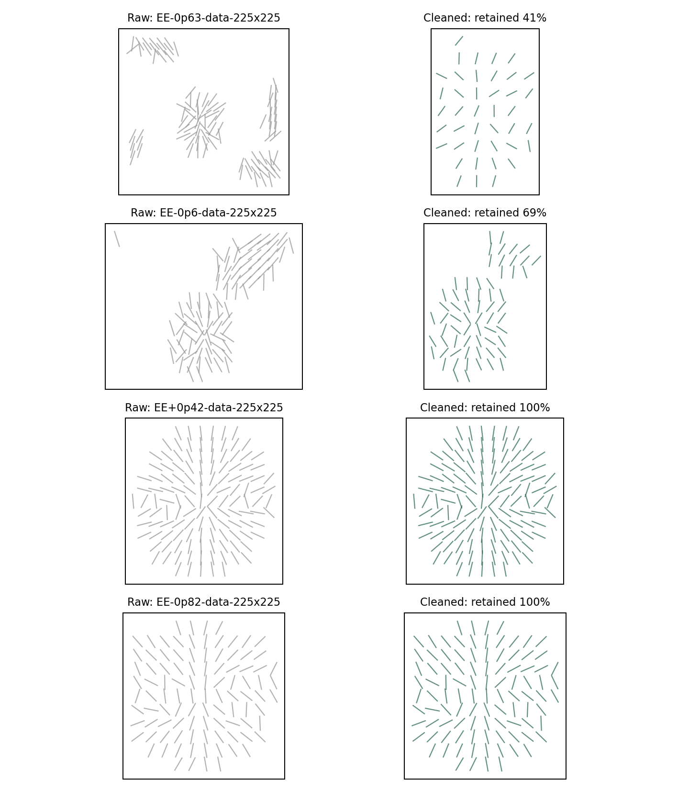
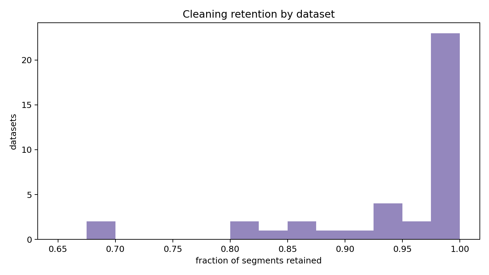
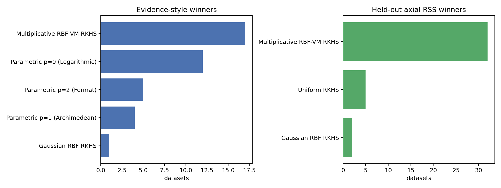
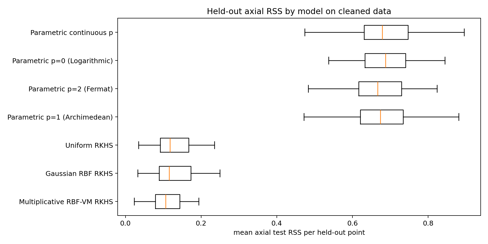
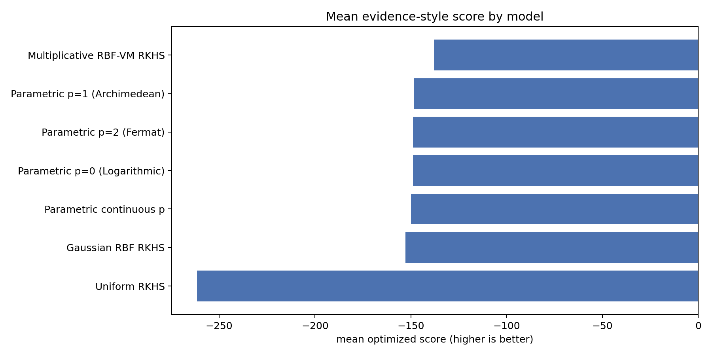

# Cleaned Axial Line-Field Comparison

Datasets found: **39**
Datasets processed after cleaning: **39**
Datasets skipped: **0**

## Cleaning Rule

The cleaned experiment starts from the same `data/**/arrow_segments.mat` files but treats each segment as an axial line-field observation, so `phi` and `phi+pi` represent the same biological orientation. A segment is retained only if its midpoint lies inside the central circular ROI of the corresponding `arrow_maps.mat` grid. For the available `150 x 150` arrow maps this uses center `(75,75)` and radius `0.39 * 150 = 58.5`. This rule intentionally preserves the central circular line field and removes peripheral/extraneous line segments outside the circle.

Across the datasets, the median retention was `0.992`, with range `0.414` to `1.000`. The median cleaned sample size was `123` segments. The report therefore does not switch to a manually selected subset; it defines a cleaned version of every dataset by the same central-ROI rule.

## Model and Metric Changes

Because the cleaned data are line fields, the primary loss is now axial RSS: `r_i = 0.5 atan2(sin(2(phi_i-phi_hat_i)), cos(2(phi_i-phi_hat_i)))`. This resolves the sign ambiguity that previously made `phi` and `phi+pi` look maximally different under signed-angle RSS. The parametric models are unchanged geometrically: fixed `p in {0,1,2}` and continuous `p in (-1,3)` are fit by minimizing axial residuals. The kernel regressions are also made axial by fitting the doubled-angle embedding `(cos 2phi, sin 2phi)` with independent GP outputs under the same covariance matrix, then mapping predictions back to an orientation by `0.5 atan2(sin_hat, cos_hat)`.

The kernel bandwidth sweep is dataset-adaptive. For each cleaned dataset, let `s_X=max(range(x), range(y), 1)` and let `d_nn` be the median nearest-neighbor spacing. The 14 bandwidth candidates are `ell in geomspace(max(0.5 d_nn, s_X/80, 1e-3), max(1.5 s_X, 4 max(0.5 d_nn, s_X/80, 1e-3)), 14)`. This replaces the earlier absolute grid `geomspace(0.2, 220, 14)`, which mixed sub-pixel scales with scales larger than the cleaned field of view.

The RSS comparison is therefore the fairest comparison in this report: every model is trained only on the training folds and scored by held-out axial RSS. The evidence-style comparison is useful but should be read more carefully, because the kernel evidence is the optimized GP marginal likelihood of the two-dimensional doubled-angle embedding, while the parametric evidence is a BIC approximation from axial residuals. Both are reasonable evidence-style summaries of line-field fit, but they are not an exact common-prior Bayes factor calculation.

## Evidence-Style Winner Counts
| model | wins |
|---|---|
| Multiplicative RBF-VM RKHS | 17 |
| Parametric p=0 (Logarithmic) | 12 |
| Parametric p=2 (Fermat) | 5 |
| Parametric p=1 (Archimedean) | 4 |
| Gaussian RBF RKHS | 1 |

## Held-Out Axial RSS Winner Counts
| model | wins |
|---|---|
| Multiplicative RBF-VM RKHS | 32 |
| Uniform RKHS | 5 |
| Gaussian RBF RKHS | 2 |

## Parametric-Only Evidence Winner Counts
| model | wins |
|---|---|
| Parametric p=0 (Logarithmic) | 18 |
| Parametric p=1 (Archimedean) | 10 |
| Parametric p=2 (Fermat) | 10 |
| Parametric continuous p | 1 |

## Parametric-Only RSS Winner Counts
| model | wins |
|---|---|
| Parametric p=1 (Archimedean) | 14 |
| Parametric p=2 (Fermat) | 12 |
| Parametric p=0 (Logarithmic) | 8 |
| Parametric continuous p | 5 |

## Evidence Summary
| model | family | datasets | evidence_score_mean | evidence_score_median | p_median |
|---|---|---|---|---|---|
| Multiplicative RBF-VM RKHS | kernel_gp_line_embedding_lml | 39 | -137.8669 | -133.453 |  |
| Parametric p=1 (Archimedean) | parametric_fixed_p | 39 | -148.5231 | -149.6385 | 1.0 |
| Parametric p=2 (Fermat) | parametric_fixed_p | 39 | -148.7812 | -150.1253 | 2.0 |
| Parametric p=0 (Logarithmic) | parametric_fixed_p | 39 | -148.9515 | -151.2532 | 0.0 |
| Parametric continuous p | parametric_continuous_p | 39 | -149.9811 | -151.756 | 0.4071 |
| Gaussian RBF RKHS | kernel_gp_line_embedding_lml | 39 | -152.7398 | -143.4758 |  |
| Uniform RKHS | kernel_gp_line_embedding_lml | 39 | -261.6682 | -261.9097 |  |

## RSS Summary
| model | family | datasets | mean_test_rss_mean | mean_test_rss_median | mean_test_mae_deg_mean | p_median |
|---|---|---|---|---|---|---|
| Multiplicative RBF-VM RKHS | kernel_gp_line_embedding_cv | 39 | 0.1079 | 0.106 | 11.4955 |  |
| Gaussian RBF RKHS | kernel_gp_line_embedding_cv | 39 | 0.1291 | 0.116 | 12.5354 |  |
| Uniform RKHS | kernel_gp_line_embedding_cv | 39 | 0.1302 | 0.1176 | 12.8051 |  |
| Parametric p=1 (Archimedean) | parametric_fixed_p | 39 | 0.6783 | 0.6742 | 39.8836 | 1.0 |
| Parametric p=2 (Fermat) | parametric_fixed_p | 39 | 0.6828 | 0.667 | 40.111 | 2.0 |
| Parametric p=0 (Logarithmic) | parametric_fixed_p | 39 | 0.6889 | 0.6875 | 40.1406 | 0.0 |
| Parametric continuous p | parametric_continuous_p | 39 | 0.6953 | 0.6789 | 40.3323 | 0.3872 |

## Plots

## Artifacts
- `cleaning_stats.csv`
- `kernel_evidence_by_dataset.csv`
- `kernel_cv_rss_by_dataset.csv`
- `parametric_full_data_scores.csv`
- `parametric_cv_scores.csv`
- `combined_evidence_scores.csv`
- `combined_cv_rss_scores.csv`
- `evidence_summary.csv`
- `rss_summary.csv`
- `evidence_winners.csv`
- `rss_winners.csv`
