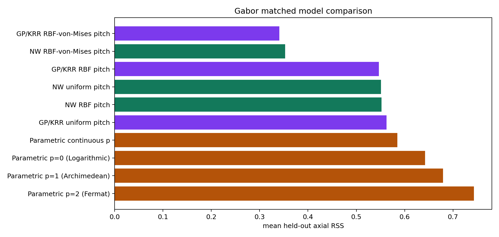
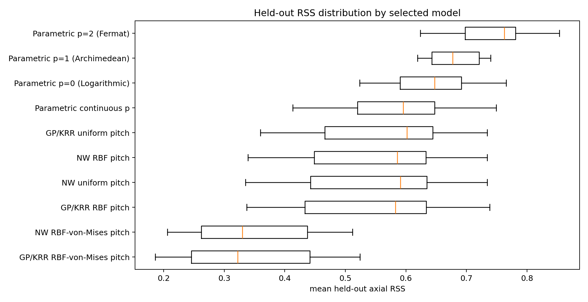
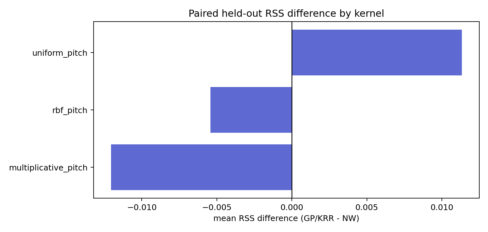
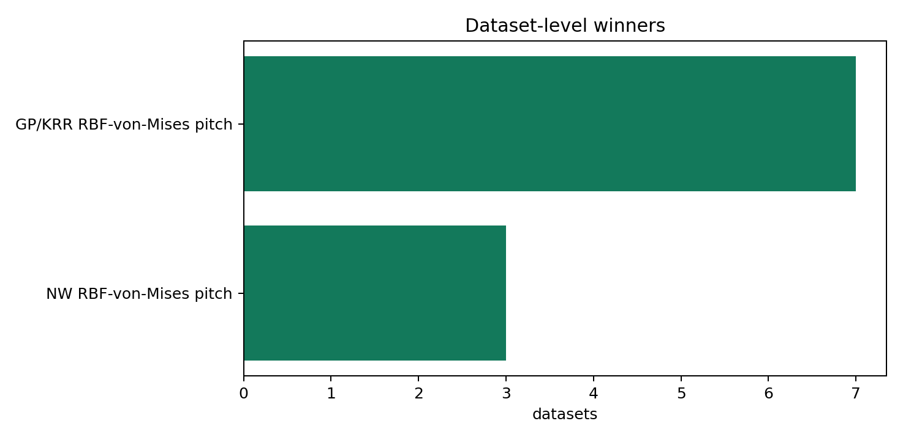
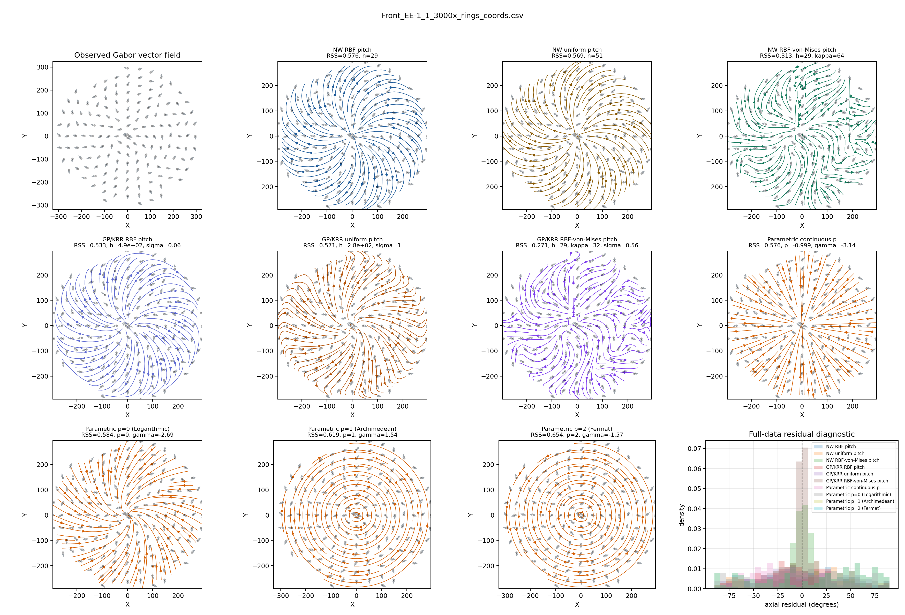
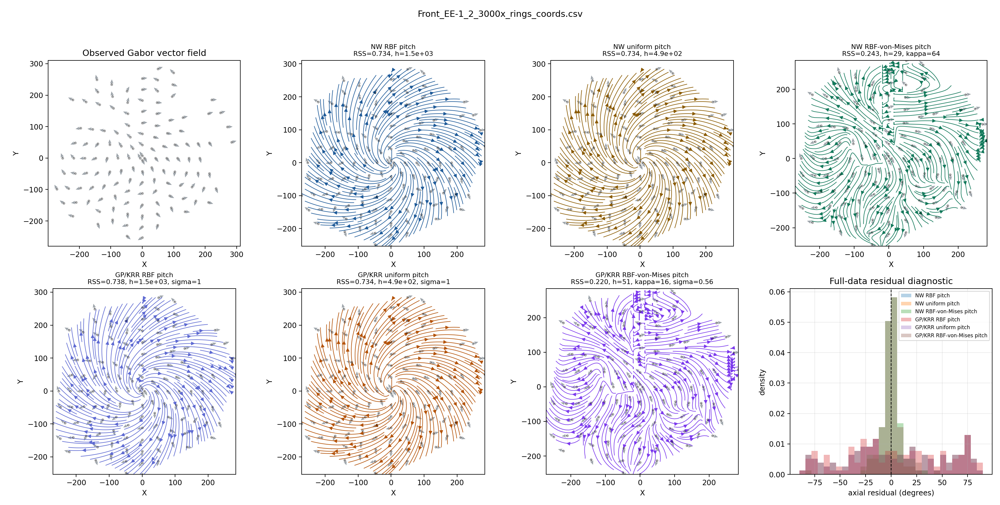
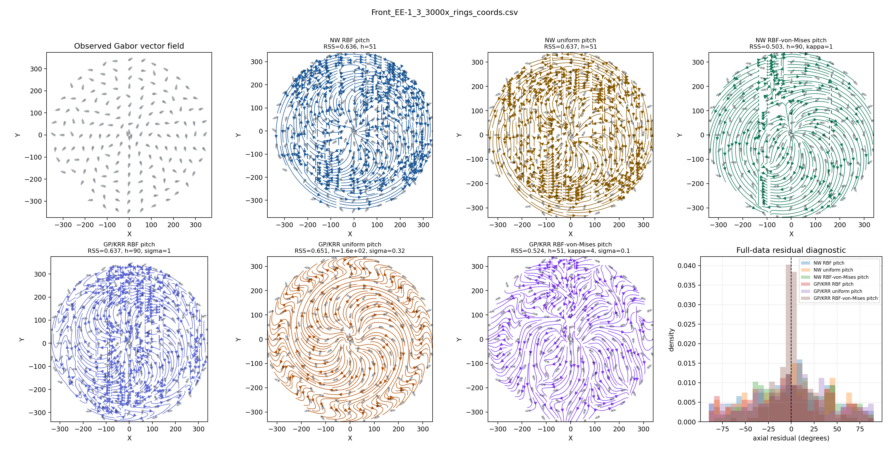

# Gabor Matched Model Comparison

The parametric, Nadaraya-Watson, and GP/KRR rows are scored on the same shuffled held-out folds using a fixed random seed. The kernel estimators smooth the local Gabor pitch angle on the doubled-angle embedding and reconstruct the streamline direction as `atan2(y, x) + alpha-prime`.

The GP/KRR rows use the posterior-mean/kernel-ridge form `K_* (K + sigma_n^2 I)^{-1} U`. For the uniform kernel this should be read as regularized kernel regression rather than a strictly valid GP covariance model.

## Selected Model Summary

| estimator | model | kernel | datasets | mean_test_rss_mean | mean_test_rss_median | mean_test_mae_deg_mean |
| --- | --- | --- | --- | --- | --- | --- |
| GP/KRR | GP/KRR RBF-von-Mises pitch | multiplicative_pitch | 10 | 0.3407 | 0.3222 | 24.8798 |
| Nadaraya-Watson | NW RBF-von-Mises pitch | multiplicative_pitch | 10 | 0.3527 | 0.3297 | 25.9152 |
| GP/KRR | GP/KRR RBF pitch | rbf_pitch | 10 | 0.5466 | 0.5829 | 34.4555 |
| Nadaraya-Watson | NW uniform pitch | uniform_pitch | 10 | 0.5513 | 0.5907 | 34.7292 |
| Nadaraya-Watson | NW RBF pitch | rbf_pitch | 10 | 0.552 | 0.5858 | 34.704 |
| GP/KRR | GP/KRR uniform pitch | uniform_pitch | 10 | 0.5626 | 0.6019 | 35.0882 |
| Parametric | Parametric continuous p | parametric | 10 | 0.5851 | 0.5955 | 36.3259 |
| Parametric | Parametric p=0 (Logarithmic) | parametric | 10 | 0.6425 | 0.6474 | 38.3903 |
| Parametric | Parametric p=1 (Archimedean) | parametric | 10 | 0.6795 | 0.6775 | 39.8167 |
| Parametric | Parametric p=2 (Fermat) | parametric | 10 | 0.7433 | 0.7623 | 42.1284 |

## Paired RSS Difference

| dataset | kernel | GP/KRR | Nadaraya-Watson | Parametric | gp_minus_nw_rss |
| --- | --- | --- | --- | --- | --- |
| Front_EE-1_1_3000x_rings_coords.csv | multiplicative_pitch | 0.2705 | 0.3127 |  | -0.0422 |
| Front_EE-1_1_3000x_rings_coords.csv | parametric |  |  | 0.6084 |  |
| Front_EE-1_1_3000x_rings_coords.csv | rbf_pitch | 0.533 | 0.5761 |  | -0.0431 |
| Front_EE-1_1_3000x_rings_coords.csv | uniform_pitch | 0.5715 | 0.5686 |  | 0.0029 |
| Front_EE-1_2_3000x_rings_coords.csv | multiplicative_pitch | 0.22 | 0.2426 |  | -0.0226 |
| Front_EE-1_2_3000x_rings_coords.csv | parametric |  |  | 0.7601 |  |
| Front_EE-1_2_3000x_rings_coords.csv | rbf_pitch | 0.7384 | 0.7342 |  | 0.0041 |
| Front_EE-1_2_3000x_rings_coords.csv | uniform_pitch | 0.7342 | 0.7342 |  | 4.66e-15 |
| Front_EE-1_3_3000x_rings_coords.csv | multiplicative_pitch | 0.524 | 0.503 |  | 0.021 |
| Front_EE-1_3_3000x_rings_coords.csv | parametric |  |  | 0.7126 |  |
| Front_EE-1_3_3000x_rings_coords.csv | rbf_pitch | 0.6373 | 0.6358 |  | 0.0015 |
| Front_EE-1_3_3000x_rings_coords.csv | uniform_pitch | 0.6508 | 0.6366 |  | 0.0142 |
| Front_EE-1_4_3000x_rings_coords.csv | multiplicative_pitch | 0.4122 | 0.407 |  | 0.0052 |
| Front_EE-1_4_3000x_rings_coords.csv | parametric |  |  | 0.6359 |  |
| Front_EE-1_4_3000x_rings_coords.csv | rbf_pitch | 0.5869 | 0.5925 |  | -0.0057 |
| Front_EE-1_4_3000x_rings_coords.csv | uniform_pitch | 0.5914 | 0.6043 |  | -0.0129 |
| Front_EE-1_5_3000x_rings_coords.csv | multiplicative_pitch | 0.299 | 0.3009 |  | -0.002 |
| Front_EE-1_5_3000x_rings_coords.csv | parametric |  |  | 0.6126 |  |
| Front_EE-1_5_3000x_rings_coords.csv | rbf_pitch | 0.3995 | 0.4062 |  | -0.0066 |
| Front_EE-1_5_3000x_rings_coords.csv | uniform_pitch | 0.4309 | 0.4001 |  | 0.0309 |
| Front_EE1_1_3000x_rings_coords.csv | multiplicative_pitch | 0.1861 | 0.206 |  | -0.0199 |
| Front_EE1_1_3000x_rings_coords.csv | parametric |  |  | 0.6638 |  |
| Front_EE1_1_3000x_rings_coords.csv | rbf_pitch | 0.6283 | 0.6282 |  | 0.000119 |
| Front_EE1_1_3000x_rings_coords.csv | uniform_pitch | 0.6347 | 0.6278 |  | 0.0069 |
| Front_EE1_2_3000x_rings_coords.csv | multiplicative_pitch | 0.461 | 0.5118 |  | -0.0507 |
| Front_EE1_2_3000x_rings_coords.csv | parametric |  |  | 0.7184 |  |
| Front_EE1_2_3000x_rings_coords.csv | rbf_pitch | 0.6352 | 0.6348 |  | 0.000318 |
| Front_EE1_2_3000x_rings_coords.csv | uniform_pitch | 0.6475 | 0.6395 |  | 0.008 |
| Front_EE1_3_3000x_rings_coords.csv | multiplicative_pitch | 0.3454 | 0.3466 |  | -0.0012 |
| Front_EE1_3_3000x_rings_coords.csv | parametric |  |  | 0.6902 |  |
| Front_EE1_3_3000x_rings_coords.csv | rbf_pitch | 0.3913 | 0.3943 |  | -0.003 |
| Front_EE1_3_3000x_rings_coords.csv | uniform_pitch | 0.393 | 0.3894 |  | 0.0036 |
| Front_EE1_4_3000x_rings_coords.csv | multiplicative_pitch | 0.237 | 0.2493 |  | -0.0123 |
| Front_EE1_4_3000x_rings_coords.csv | parametric |  |  | 0.5505 |  |
| Front_EE1_4_3000x_rings_coords.csv | rbf_pitch | 0.337 | 0.3389 |  | -0.0019 |
| Front_EE1_4_3000x_rings_coords.csv | uniform_pitch | 0.3597 | 0.3351 |  | 0.0245 |
| Front_EE1_5_3000x_rings_coords.csv | multiplicative_pitch | 0.4513 | 0.4471 |  | 0.0042 |
| Front_EE1_5_3000x_rings_coords.csv | parametric |  |  | 0.6737 |  |
| Front_EE1_5_3000x_rings_coords.csv | rbf_pitch | 0.579 | 0.579 |  | -5.43e-05 |
| Front_EE1_5_3000x_rings_coords.csv | uniform_pitch | 0.6124 | 0.5771 |  | 0.0353 |

## Plots

### Front_EE-1_1_3000x_rings_coords.csv

### Front_EE-1_2_3000x_rings_coords.csv

### Front_EE-1_3_3000x_rings_coords.csv

