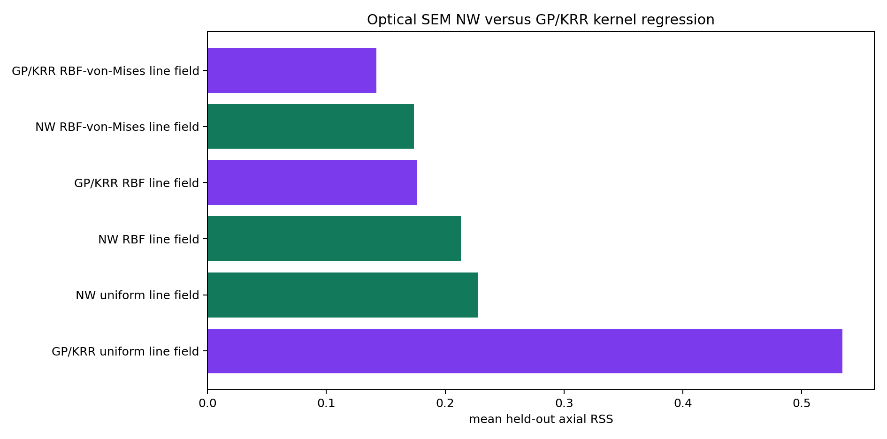
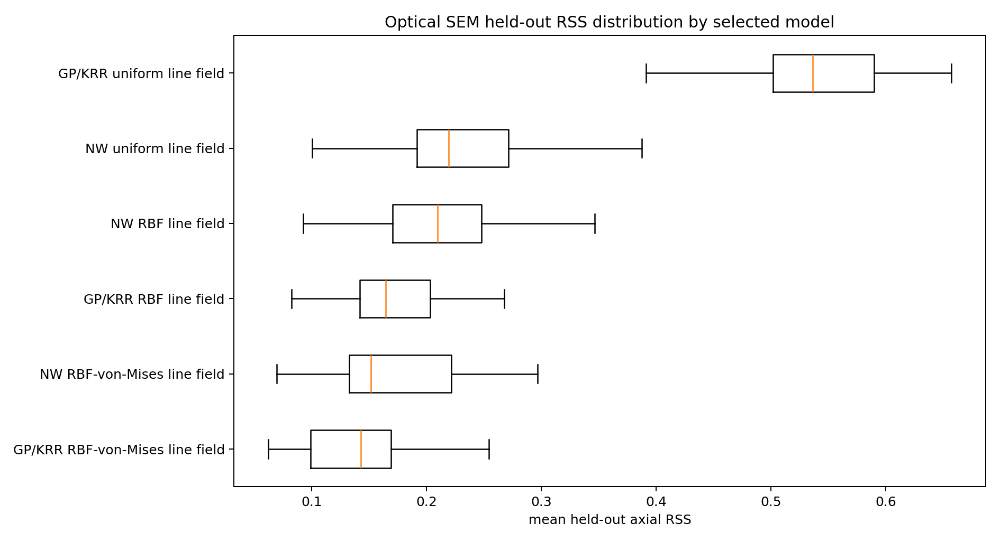
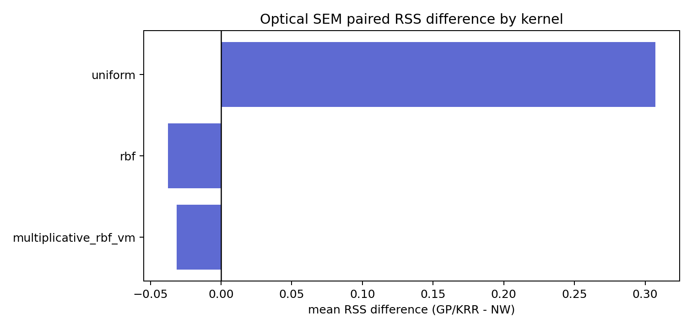
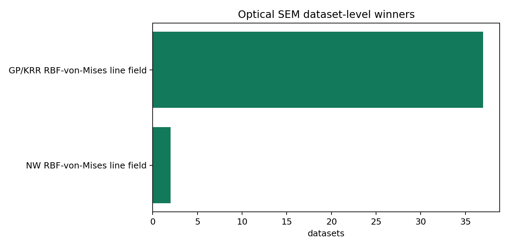
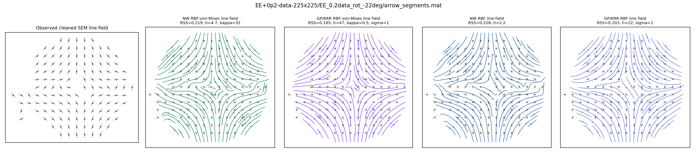
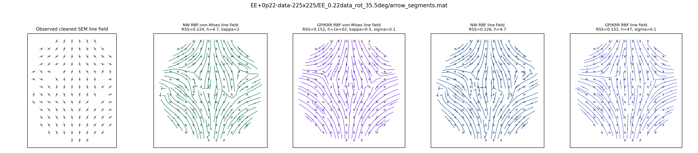
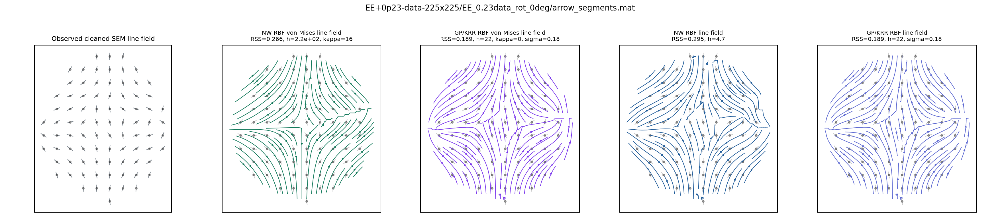

# Optical SEM NW versus GP/KRR Kernel Regression

Both estimator classes regress the doubled-angle line-field embedding `(cos 2 phi, sin 2 phi)` and are scored by spatially blocked held-out axial RSS.

The GP/KRR rows use `K_* (K + sigma_n^2 I)^{-1} U`. The uniform-kernel row is regularized kernel regression rather than a strictly valid GP covariance model.

## Selected Model Summary

| estimator | model | kernel | datasets | mean_test_rss_mean | mean_test_rss_median | mean_test_mae_deg_mean |
| --- | --- | --- | --- | --- | --- | --- |
| GP/KRR | GP/KRR RBF-von-Mises line field | multiplicative_rbf_vm | 39 | 0.1422 | 0.1427 | 14.3291 |
| Nadaraya-Watson | NW RBF-von-Mises line field | multiplicative_rbf_vm | 39 | 0.1737 | 0.1519 | 16.5538 |
| GP/KRR | GP/KRR RBF line field | rbf | 39 | 0.176 | 0.1646 | 16.1645 |
| Nadaraya-Watson | NW RBF line field | rbf | 39 | 0.2134 | 0.2095 | 19.1127 |
| Nadaraya-Watson | NW uniform line field | uniform | 39 | 0.2273 | 0.2194 | 20.214 |
| GP/KRR | GP/KRR uniform line field | uniform | 39 | 0.5345 | 0.5362 | 34.763 |

## Paired RSS Difference

| dataset | kernel | GP/KRR | Nadaraya-Watson | gp_minus_nw_rss |
| --- | --- | --- | --- | --- |
| EE+0p2-data-225x225/EE_0.2data_rot_-22deg/arrow_segments.mat | multiplicative_rbf_vm | 0.1651 | 0.2195 | -0.0544 |
| EE+0p2-data-225x225/EE_0.2data_rot_-22deg/arrow_segments.mat | rbf | 0.2032 | 0.2279 | -0.0247 |
| EE+0p2-data-225x225/EE_0.2data_rot_-22deg/arrow_segments.mat | uniform | 0.6091 | 0.2339 | 0.3752 |
| EE+0p22-data-225x225/EE_0.22data_rot_35.5deg/arrow_segments.mat | multiplicative_rbf_vm | 0.1522 | 0.224 | -0.0718 |
| EE+0p22-data-225x225/EE_0.22data_rot_35.5deg/arrow_segments.mat | rbf | 0.1524 | 0.2259 | -0.0735 |
| EE+0p22-data-225x225/EE_0.22data_rot_35.5deg/arrow_segments.mat | uniform | 0.4685 | 0.249 | 0.2195 |
| EE+0p23-data-225x225/EE_0.23data_rot_0deg/arrow_segments.mat | multiplicative_rbf_vm | 0.1893 | 0.2656 | -0.0763 |
| EE+0p23-data-225x225/EE_0.23data_rot_0deg/arrow_segments.mat | rbf | 0.1893 | 0.2954 | -0.1061 |
| EE+0p23-data-225x225/EE_0.23data_rot_0deg/arrow_segments.mat | uniform | 0.5255 | 0.3102 | 0.2153 |
| EE+0p4-data-225x225/EE_0.4data_rot_-67deg/arrow_segments.mat | multiplicative_rbf_vm | 0.0924 | 0.1231 | -0.0307 |
| EE+0p4-data-225x225/EE_0.4data_rot_-67deg/arrow_segments.mat | rbf | 0.1242 | 0.1261 | -0.0019 |
| EE+0p4-data-225x225/EE_0.4data_rot_-67deg/arrow_segments.mat | uniform | 0.587 | 0.1458 | 0.4413 |
| EE+0p42-data-225x225/EE_0.42data_rot_-7.5deg/arrow_segments.mat | multiplicative_rbf_vm | 0.1179 | 0.1414 | -0.0234 |
| EE+0p42-data-225x225/EE_0.42data_rot_-7.5deg/arrow_segments.mat | rbf | 0.1535 | 0.1789 | -0.0255 |
| EE+0p42-data-225x225/EE_0.42data_rot_-7.5deg/arrow_segments.mat | uniform | 0.4774 | 0.1996 | 0.2777 |
| EE+0p43-data-225x225/EE_0.43data_rot_14.5deg/arrow_segments.mat | multiplicative_rbf_vm | 0.2264 | 0.2678 | -0.0415 |
| EE+0p43-data-225x225/EE_0.43data_rot_14.5deg/arrow_segments.mat | rbf | 0.3057 | 0.3465 | -0.0408 |
| EE+0p43-data-225x225/EE_0.43data_rot_14.5deg/arrow_segments.mat | uniform | 0.6492 | 0.3281 | 0.3212 |
| EE+0p6-data-225x225/EE_0.6data_rot_39.5deg/arrow_segments.mat | multiplicative_rbf_vm | 0.1068 | 0.121 | -0.0141 |
| EE+0p6-data-225x225/EE_0.6data_rot_39.5deg/arrow_segments.mat | rbf | 0.1818 | 0.1932 | -0.0114 |
| EE+0p6-data-225x225/EE_0.6data_rot_39.5deg/arrow_segments.mat | uniform | 0.6037 | 0.2088 | 0.395 |
| EE+0p62-data-225x225/EE_0.62data_rot_37.5deg/arrow_segments.mat | multiplicative_rbf_vm | 0.1209 | 0.1392 | -0.0183 |
| EE+0p62-data-225x225/EE_0.62data_rot_37.5deg/arrow_segments.mat | rbf | 0.1598 | 0.2367 | -0.0769 |
| EE+0p62-data-225x225/EE_0.62data_rot_37.5deg/arrow_segments.mat | uniform | 0.5362 | 0.2882 | 0.2479 |
| EE+0p63-data-225x225/EE_0.63data_rot_-30.5deg/arrow_segments.mat | multiplicative_rbf_vm | 0.1459 | 0.143 | 0.0028 |
| EE+0p63-data-225x225/EE_0.63data_rot_-30.5deg/arrow_segments.mat | rbf | 0.1857 | 0.2043 | -0.0186 |
| EE+0p63-data-225x225/EE_0.63data_rot_-30.5deg/arrow_segments.mat | uniform | 0.5231 | 0.1922 | 0.3308 |
| EE+0p8-data-226x225/EE_0.8data_rot_0deg/arrow_segments.mat | multiplicative_rbf_vm | 0.1595 | 0.2012 | -0.0417 |
| EE+0p8-data-226x225/EE_0.8data_rot_0deg/arrow_segments.mat | rbf | 0.1898 | 0.2218 | -0.032 |
| EE+0p8-data-226x225/EE_0.8data_rot_0deg/arrow_segments.mat | uniform | 0.6057 | 0.2241 | 0.3817 |
| EE+0p82-data-226x225/EE_0.82data_rot_-24.5deg/arrow_segments.mat | multiplicative_rbf_vm | 0.1577 | 0.1956 | -0.0379 |
| EE+0p82-data-226x225/EE_0.82data_rot_-24.5deg/arrow_segments.mat | rbf | 0.1593 | 0.2095 | -0.0502 |
| EE+0p82-data-226x225/EE_0.82data_rot_-24.5deg/arrow_segments.mat | uniform | 0.5 | 0.2217 | 0.2783 |
| EE+0p83-data-226x225/EE_0.83data_rot_43deg/arrow_segments.mat | multiplicative_rbf_vm | 0.0898 | 0.1037 | -0.0139 |
| EE+0p83-data-226x225/EE_0.83data_rot_43deg/arrow_segments.mat | rbf | 0.1006 | 0.1199 | -0.0193 |
| EE+0p83-data-226x225/EE_0.83data_rot_43deg/arrow_segments.mat | uniform | 0.503 | 0.131 | 0.372 |
| EE+1-data-225x225/EE_1data_rot_0deg/arrow_segments.mat | multiplicative_rbf_vm | 0.1014 | 0.1438 | -0.0423 |
| EE+1-data-225x225/EE_1data_rot_0deg/arrow_segments.mat | rbf | 0.1505 | 0.1955 | -0.045 |
| EE+1-data-225x225/EE_1data_rot_0deg/arrow_segments.mat | uniform | 0.5758 | 0.2013 | 0.3745 |
| EE+12-data-225x225/EE_12data_rot_-41.5deg/arrow_segments.mat | multiplicative_rbf_vm | 0.1436 | 0.1514 | -0.0077 |
| EE+12-data-225x225/EE_12data_rot_-41.5deg/arrow_segments.mat | rbf | 0.1875 | 0.2052 | -0.0178 |
| EE+12-data-225x225/EE_12data_rot_-41.5deg/arrow_segments.mat | uniform | 0.5169 | 0.2024 | 0.3145 |
| EE+13-data-225x225/EE_13data_rot_34.5deg/arrow_segments.mat | multiplicative_rbf_vm | 0.1171 | 0.1401 | -0.023 |
| EE+13-data-225x225/EE_13data_rot_34.5deg/arrow_segments.mat | rbf | 0.1404 | 0.1676 | -0.0272 |
| EE+13-data-225x225/EE_13data_rot_34.5deg/arrow_segments.mat | uniform | 0.391 | 0.1892 | 0.2018 |
| EE-0p2-data-225x225/EE-0.2data_rot_62.5deg/arrow_segments.mat | multiplicative_rbf_vm | 0.1182 | 0.1295 | -0.0113 |
| EE-0p2-data-225x225/EE-0.2data_rot_62.5deg/arrow_segments.mat | rbf | 0.1352 | 0.1367 | -0.0015 |
| EE-0p2-data-225x225/EE-0.2data_rot_62.5deg/arrow_segments.mat | uniform | 0.6571 | 0.1456 | 0.5115 |
| EE-0p22-data-225x225/EE-0.22data_rot_0deg/arrow_segments.mat | multiplicative_rbf_vm | 0.0622 | 0.0696 | -0.0074 |
| EE-0p22-data-225x225/EE-0.22data_rot_0deg/arrow_segments.mat | rbf | 0.0825 | 0.0928 | -0.0103 |
| EE-0p22-data-225x225/EE-0.22data_rot_0deg/arrow_segments.mat | uniform | 0.5032 | 0.1006 | 0.4026 |
| EE-0p23-data-225x225/EE-0.23data_rot_90deg/arrow_segments.mat | multiplicative_rbf_vm | 0.1205 | 0.1509 | -0.0304 |
| EE-0p23-data-225x225/EE-0.23data_rot_90deg/arrow_segments.mat | rbf | 0.1326 | 0.1509 | -0.0183 |
| EE-0p23-data-225x225/EE-0.23data_rot_90deg/arrow_segments.mat | uniform | 0.5984 | 0.192 | 0.4064 |
| EE-0p4-data-225x225/EE-0.4data_rot_31deg/arrow_segments.mat | multiplicative_rbf_vm | 0.1524 | 0.2074 | -0.055 |
| EE-0p4-data-225x225/EE-0.4data_rot_31deg/arrow_segments.mat | rbf | 0.2202 | 0.3014 | -0.0812 |
| EE-0p4-data-225x225/EE-0.4data_rot_31deg/arrow_segments.mat | uniform | 0.5679 | 0.3072 | 0.2607 |
| EE-0p42-data-225x225/EE-0.42data_rot_-12deg/arrow_segments.mat | multiplicative_rbf_vm | 0.173 | 0.2249 | -0.0519 |
| EE-0p42-data-225x225/EE-0.42data_rot_-12deg/arrow_segments.mat | rbf | 0.1755 | 0.2458 | -0.0702 |
| EE-0p42-data-225x225/EE-0.42data_rot_-12deg/arrow_segments.mat | uniform | 0.5199 | 0.2389 | 0.2811 |
| EE-0p43-data-225x225/EE-0.43data_rot_56.5deg/arrow_segments.mat | multiplicative_rbf_vm | 0.088 | 0.1558 | -0.0678 |
| EE-0p43-data-225x225/EE-0.43data_rot_56.5deg/arrow_segments.mat | rbf | 0.1365 | 0.197 | -0.0605 |
| EE-0p43-data-225x225/EE-0.43data_rot_56.5deg/arrow_segments.mat | uniform | 0.5502 | 0.2194 | 0.3308 |
| EE-0p6-data-225x225/EE-0.6data_rot_-67deg/arrow_segments.mat | multiplicative_rbf_vm | 0.2542 | 0.2496 | 0.0046 |
| EE-0p6-data-225x225/EE-0.6data_rot_-67deg/arrow_segments.mat | rbf | 0.2542 | 0.2496 | 0.0046 |
| EE-0p6-data-225x225/EE-0.6data_rot_-67deg/arrow_segments.mat | uniform | 0.3207 | 0.2705 | 0.0502 |
| EE-0p62-data-225x225/EE-0.62data_rot_27deg/arrow_segments.mat | multiplicative_rbf_vm | 0.2077 | 0.2384 | -0.0306 |
| EE-0p62-data-225x225/EE-0.62data_rot_27deg/arrow_segments.mat | rbf | 0.2305 | 0.2651 | -0.0347 |
| EE-0p62-data-225x225/EE-0.62data_rot_27deg/arrow_segments.mat | uniform | 0.6388 | 0.2767 | 0.3621 |
| EE-0p63-data-225x225/EE-0.63data_rot_6deg/arrow_segments.mat | multiplicative_rbf_vm | 0.229 | 0.2753 | -0.0463 |
| EE-0p63-data-225x225/EE-0.63data_rot_6deg/arrow_segments.mat | rbf | 0.3133 | 0.3658 | -0.0525 |
| EE-0p63-data-225x225/EE-0.63data_rot_6deg/arrow_segments.mat | uniform | 0.444 | 0.3875 | 0.0565 |
| EE-0p8-data-226x225/EE-0.8data_rot_34deg/arrow_segments.mat | multiplicative_rbf_vm | 0.0996 | 0.111 | -0.0114 |
| EE-0p8-data-226x225/EE-0.8data_rot_34deg/arrow_segments.mat | rbf | 0.2036 | 0.2116 | -0.008 |
| EE-0p8-data-226x225/EE-0.8data_rot_34deg/arrow_segments.mat | uniform | 0.4193 | 0.2082 | 0.2111 |
| EE-0p82-data-225x225/EE-0.82data_rot_37deg/arrow_segments.mat | multiplicative_rbf_vm | 0.1253 | 0.1478 | -0.0224 |
| EE-0p82-data-225x225/EE-0.82data_rot_37deg/arrow_segments.mat | rbf | 0.1597 | 0.1954 | -0.0357 |
| EE-0p82-data-225x225/EE-0.82data_rot_37deg/arrow_segments.mat | uniform | 0.5077 | 0.2057 | 0.3021 |
| EE-0p83-data-226x225/EE-0.83data_rot_-41.5deg/arrow_segments.mat | multiplicative_rbf_vm | 0.183 | 0.2039 | -0.0208 |
| EE-0p83-data-226x225/EE-0.83data_rot_-41.5deg/arrow_segments.mat | rbf | 0.234 | 0.2772 | -0.0432 |
| EE-0p83-data-226x225/EE-0.83data_rot_-41.5deg/arrow_segments.mat | uniform | 0.5594 | 0.2646 | 0.2947 |
| EE-1-data-368x368/EE-1data_rot_58deg/arrow_segments.mat | multiplicative_rbf_vm | 0.0844 | 0.0905 | -0.0061 |
| EE-1-data-368x368/EE-1data_rot_58deg/arrow_segments.mat | rbf | 0.1504 | 0.1612 | -0.0109 |
| EE-1-data-368x368/EE-1data_rot_58deg/arrow_segments.mat | uniform | 0.4448 | 0.19 | 0.2547 |
| EE-1-data-368x368/EE-1data_rot_60.5deg/arrow_segments.mat | multiplicative_rbf_vm | 0.0969 | 0.1553 | -0.0584 |
| EE-1-data-368x368/EE-1data_rot_60.5deg/arrow_segments.mat | rbf | 0.1492 | 0.2133 | -0.0641 |
| EE-1-data-368x368/EE-1data_rot_60.5deg/arrow_segments.mat | uniform | 0.5377 | 0.2044 | 0.3333 |
| EE-12-data-368x368/EE-12data_rot_78.5deg/arrow_segments.mat | multiplicative_rbf_vm | 0.1531 | 0.215 | -0.0619 |
| EE-12-data-368x368/EE-12data_rot_78.5deg/arrow_segments.mat | rbf | 0.1791 | 0.2402 | -0.0611 |
| EE-12-data-368x368/EE-12data_rot_78.5deg/arrow_segments.mat | uniform | 0.4748 | 0.2726 | 0.2022 |
| EE-12-data-368x368/EE-12data_rot_80deg/arrow_segments.mat | multiplicative_rbf_vm | 0.1427 | 0.1519 | -0.0092 |
| EE-12-data-368x368/EE-12data_rot_80deg/arrow_segments.mat | rbf | 0.2003 | 0.2498 | -0.0495 |
| EE-12-data-368x368/EE-12data_rot_80deg/arrow_segments.mat | uniform | 0.5938 | 0.2842 | 0.3096 |
| EE-13-data-225x225/EE-13data_rot_59deg/arrow_segments.mat | multiplicative_rbf_vm | 0.08 | 0.0989 | -0.019 |
| EE-13-data-225x225/EE-13data_rot_59deg/arrow_segments.mat | rbf | 0.0959 | 0.1261 | -0.0302 |
| EE-13-data-225x225/EE-13data_rot_59deg/arrow_segments.mat | uniform | 0.5921 | 0.1469 | 0.4452 |
| EE-13-data-225x225/EE-13data_rot_64.5deg/arrow_segments.mat | multiplicative_rbf_vm | 0.096 | 0.1127 | -0.0167 |
| EE-13-data-225x225/EE-13data_rot_64.5deg/arrow_segments.mat | rbf | 0.144 | 0.1738 | -0.0298 |
| EE-13-data-225x225/EE-13data_rot_64.5deg/arrow_segments.mat | uniform | 0.5265 | 0.1912 | 0.3353 |
| EE0-data-225x225/EE0data_rot_34.5deg/arrow_segments.mat | multiplicative_rbf_vm | 0.0984 | 0.1362 | -0.0378 |
| EE0-data-225x225/EE0data_rot_34.5deg/arrow_segments.mat | rbf | 0.0984 | 0.1508 | -0.0524 |
| EE0-data-225x225/EE0data_rot_34.5deg/arrow_segments.mat | uniform | 0.5616 | 0.1594 | 0.4022 |
| EE0-data-225x225/EE0data_rot_37.5deg/arrow_segments.mat | multiplicative_rbf_vm | 0.083 | 0.0985 | -0.0155 |
| EE0-data-225x225/EE0data_rot_37.5deg/arrow_segments.mat | rbf | 0.0992 | 0.1247 | -0.0255 |
| EE0-data-225x225/EE0data_rot_37.5deg/arrow_segments.mat | uniform | 0.5217 | 0.1276 | 0.3941 |
| EE02-data-225x225/EE02data_rot_57.5deg/arrow_segments.mat | multiplicative_rbf_vm | 0.2405 | 0.2966 | -0.056 |
| EE02-data-225x225/EE02data_rot_57.5deg/arrow_segments.mat | rbf | 0.2676 | 0.3074 | -0.0398 |
| EE02-data-225x225/EE02data_rot_57.5deg/arrow_segments.mat | uniform | 0.468 | 0.3457 | 0.1223 |
| EE02-data-225x225/EE02data_rot_59.5deg/arrow_segments.mat | multiplicative_rbf_vm | 0.2127 | 0.229 | -0.0163 |
| EE02-data-225x225/EE02data_rot_59.5deg/arrow_segments.mat | rbf | 0.2127 | 0.229 | -0.0163 |
| EE02-data-225x225/EE02data_rot_59.5deg/arrow_segments.mat | uniform | 0.6422 | 0.2566 | 0.3856 |
| EE03-data-225x225/EE03data_rot_-20.5deg/arrow_segments.mat | multiplicative_rbf_vm | 0.2039 | 0.2523 | -0.0484 |
| EE03-data-225x225/EE03data_rot_-20.5deg/arrow_segments.mat | rbf | 0.2407 | 0.2986 | -0.058 |
| EE03-data-225x225/EE03data_rot_-20.5deg/arrow_segments.mat | uniform | 0.5807 | 0.3128 | 0.2679 |
| EE03-data-225x225/EE03data_rot_-23.5deg/arrow_segments.mat | multiplicative_rbf_vm | 0.1569 | 0.1947 | -0.0378 |
| EE03-data-225x225/EE03data_rot_-23.5deg/arrow_segments.mat | rbf | 0.1646 | 0.2026 | -0.0379 |
| EE03-data-225x225/EE03data_rot_-23.5deg/arrow_segments.mat | uniform | 0.5412 | 0.2291 | 0.3121 |

## Plots

### EE+0p2-data-225x225/EE_0.2data_rot_-22deg/arrow_segments.mat

### EE+0p22-data-225x225/EE_0.22data_rot_35.5deg/arrow_segments.mat

### EE+0p23-data-225x225/EE_0.23data_rot_0deg/arrow_segments.mat

