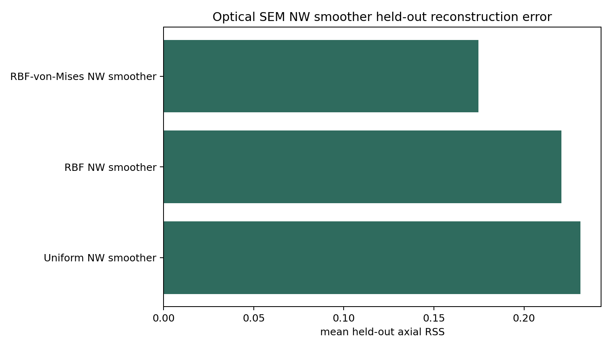
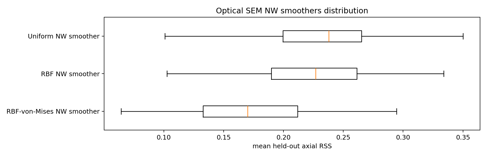
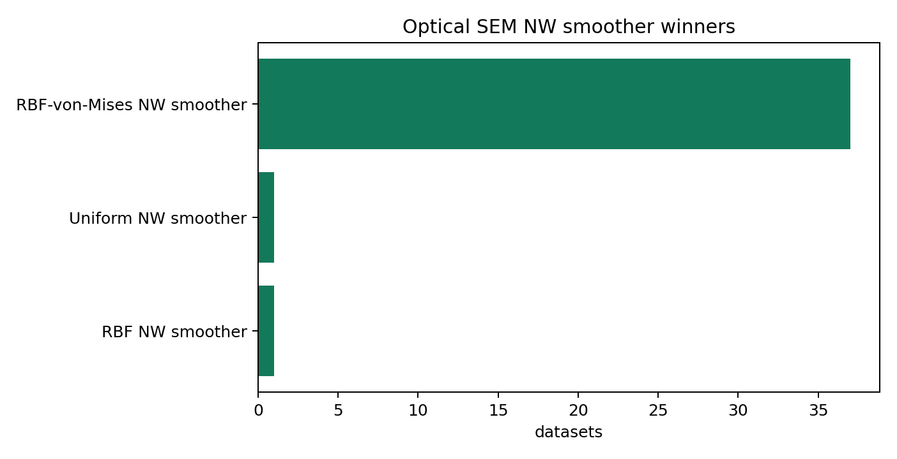
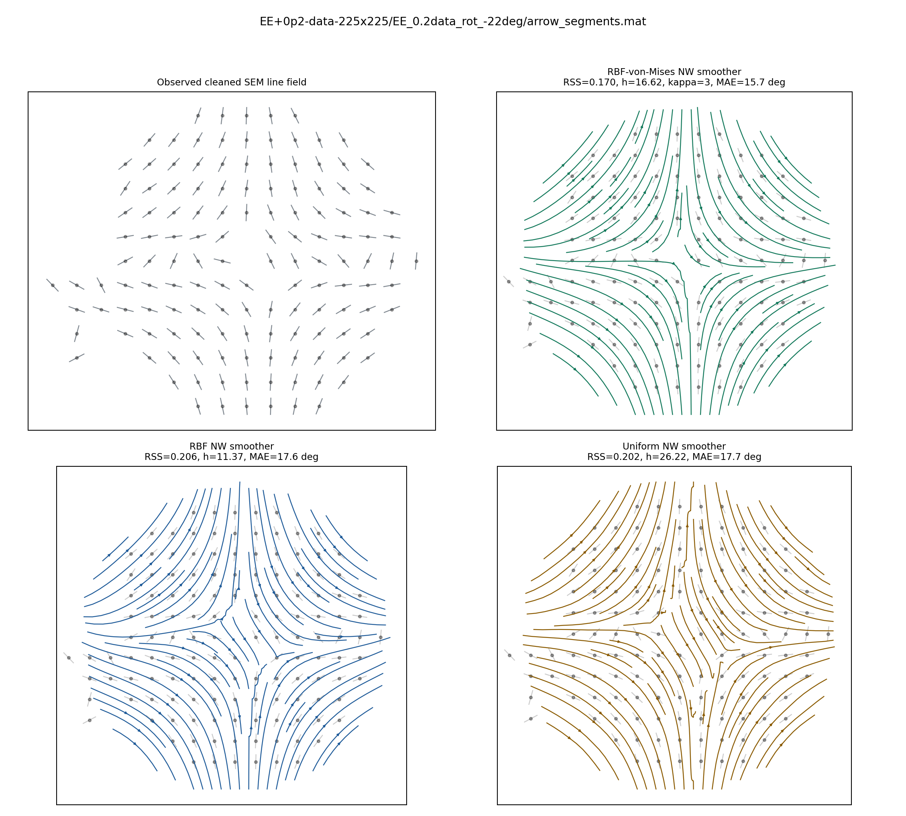
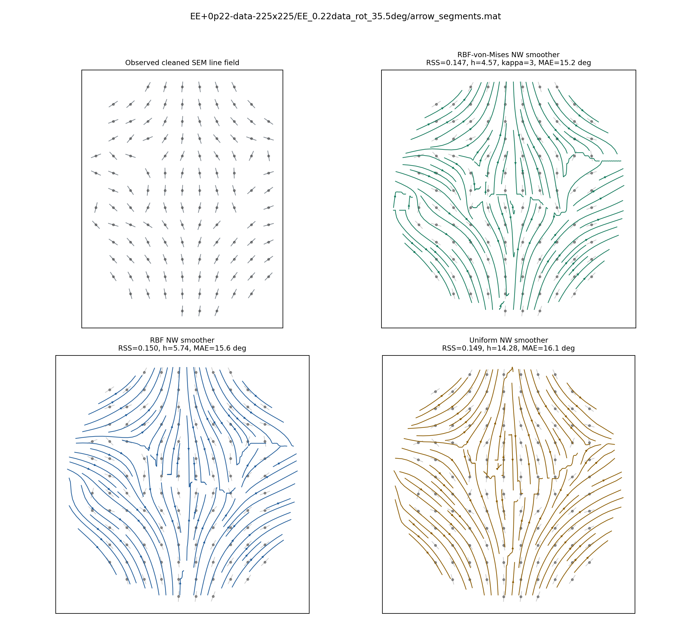
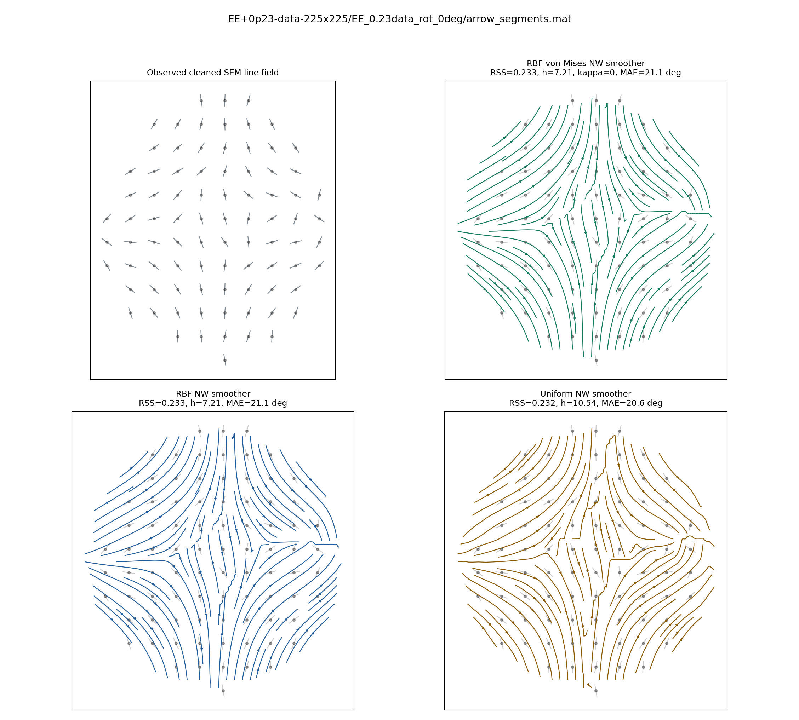
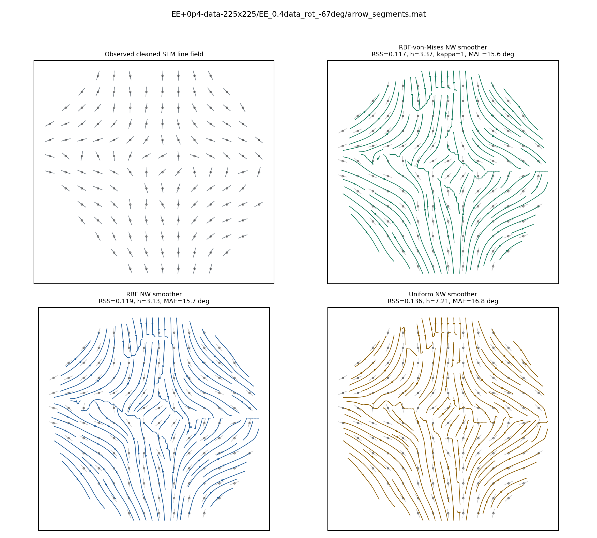
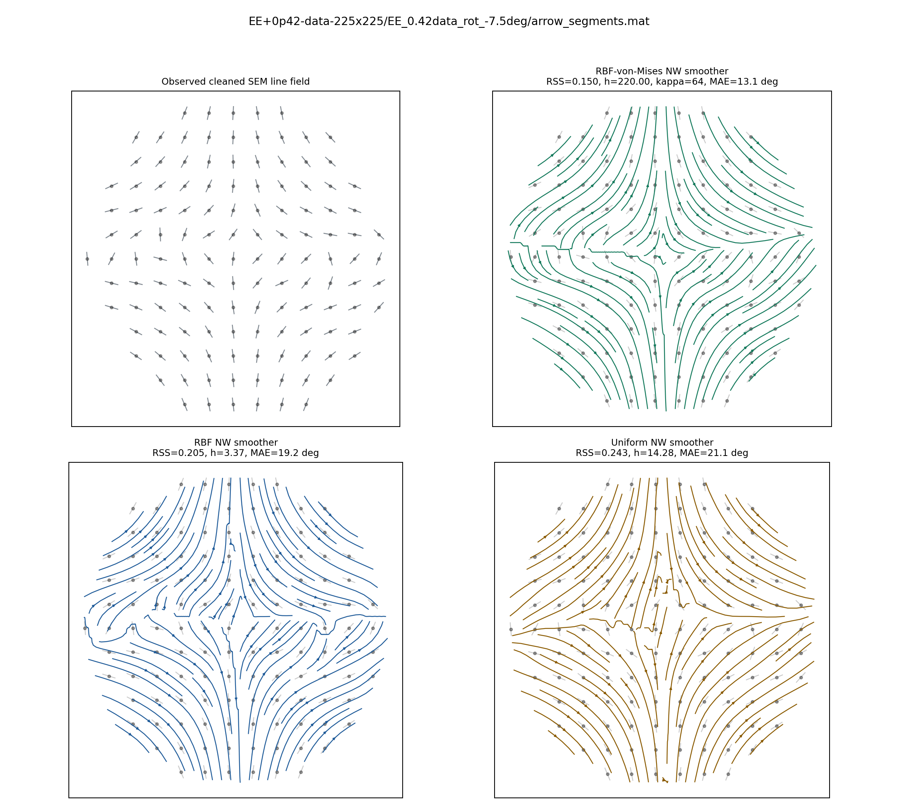
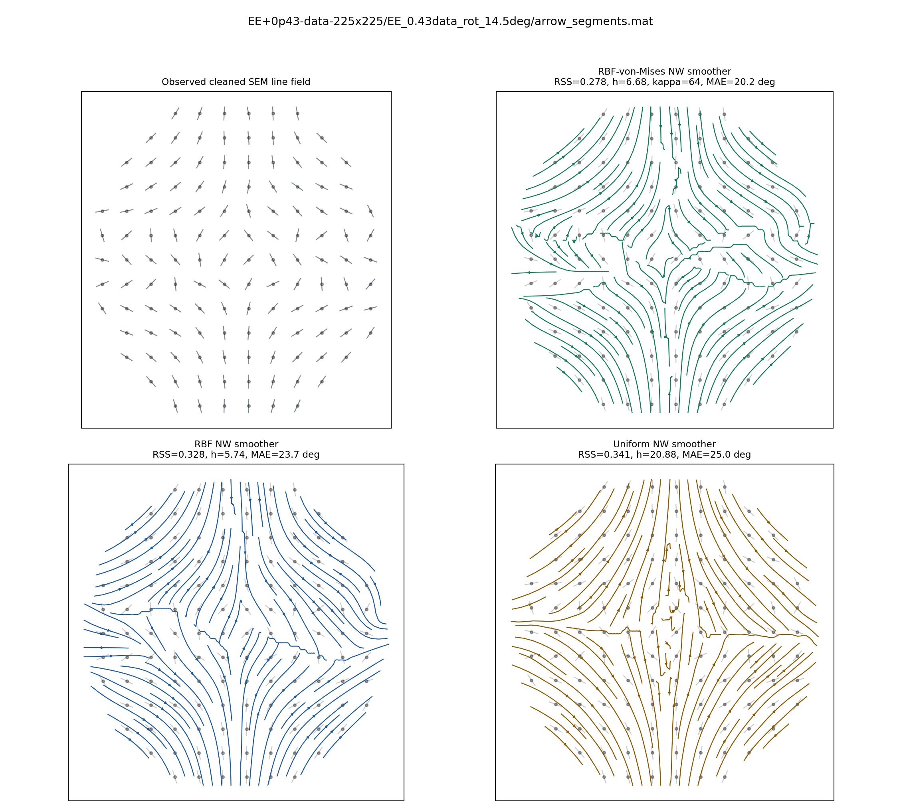

# Optical SEM Local Nadaraya-Watson Smoother Comparison

Datasets found: **39**
Datasets processed: **39**

The local smoothing models are Nadaraya-Watson smoothers on the doubled-angle line embedding `(cos 2 phi, sin 2 phi)`. The three kernels are Gaussian RBF, uniform/local-neighbourhood, and multiplicative RBF-von-Mises. Hyperparameters are selected by spatially blocked held-out axial RSS.

## Kernel Summary

| model | kernel | datasets | mean_test_rss_mean | mean_test_rss_median | mean_test_mae_deg_mean | bandwidth_median | kappa_median |
|---|---|---|---|---|---|---|---|
| RBF-von-Mises NW smoother | multiplicative_rbf_vm | 39 | 0.1746 | 0.17 | 16.7209 | 10.5378 | 32 |
| RBF NW smoother | rbf | 39 | 0.2206 | 0.227 | 19.6959 | 5.7387 |  |
| Uniform NW smoother | uniform | 39 | 0.2312 | 0.2379 | 20.524 | 14.2796 |  |

## Selected NW Smoother Summary

| model | datasets | mean_test_rss_mean | mean_test_rss_median | mean_test_mae_deg_mean |
|---|---|---|---|---|
| RBF-von-Mises NW smoother | 39 | 0.1746 | 0.17 | 16.7209 |
| RBF NW smoother | 39 | 0.2206 | 0.227 | 19.6959 |
| Uniform NW smoother | 39 | 0.2312 | 0.2379 | 20.524 |

## Plots

