# vf_exports Fixed-Grid Held-Out RSS Comparison

This rerun uses fixed, non-data-adaptive hyperparameter grids for the kernel families. The model-selection criterion is held-out axial RSS. The observed Gabor vector field is plotted with arrow opacity `alpha=0.7`; the model fits are overlaid as streamlines.

## Fixed Hyperparameter Ranges
| hyperparameter | count | min | max | grid |
|---|---|---|---|---|
| bandwidth_or_radius_ell | 72.0 | 1.0 | 1500.0 | geomspace |
| sigma_n | 17.0 | 0.001 | 10.0 | geomspace |
| kappa | 19.0 | 0.0 | 64.0 | explicit |
| parametric_fixed_p | 3.0 | 0.0 | 2.0 | {0,1,2} |
| parametric_continuous_p_bounds |  | -0.999 | 2.999 | L-BFGS-B bounds |
| parametric_gamma_bounds |  | -3.141593 | 3.141593 | L-BFGS-B bounds |

## Held-Out Axial RSS Winner Counts
| model | wins |
|---|---|
| Multiplicative RBF-VM RKHS | 6 |
| Gaussian RBF RKHS | 2 |
| Uniform RKHS | 2 |

## Held-Out Axial RSS Summary
| model | family | datasets | mean_test_rss_mean | mean_test_rss_median | mean_test_mae_deg_mean | bandwidth_median | sigma_n_median | kappa_median | p_median |
|---|---|---|---|---|---|---|---|---|---|
| Multiplicative RBF-VM RKHS | kernel_gp_line_embedding_cv_fixed_grid | 10 | 0.3396 | 0.33578 | 24.77233 | 52.82292 | 1.0 | 0.625 |  |
| Gaussian RBF RKHS | kernel_gp_line_embedding_cv_fixed_grid | 10 | 0.342 | 0.34166 | 24.87529 | 50.37089 | 0.56234 |  |  |
| Uniform RKHS | kernel_gp_line_embedding_cv_fixed_grid | 10 | 0.35765 | 0.34883 | 25.87366 | 58.55393 | 5.62341 |  |  |
| Parametric p=0 (Logarithmic) | parametric_fixed_p | 10 | 0.78506 | 0.78003 | 43.84303 |  |  |  | 0.0 |
| Parametric p=1 (Archimedean) | parametric_fixed_p | 10 | 0.79856 | 0.77365 | 43.96404 |  |  |  | 1.0 |
| Parametric continuous p | parametric_continuous_p | 10 | 0.80449 | 0.81383 | 44.3255 |  |  |  | 0.19926 |
| Parametric p=2 (Fermat) | parametric_fixed_p | 10 | 0.82784 | 0.84072 | 44.85181 |  |  |  | 2.0 |

## Plots
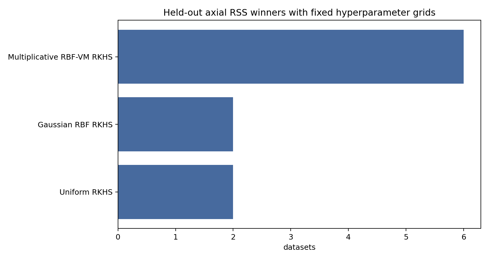

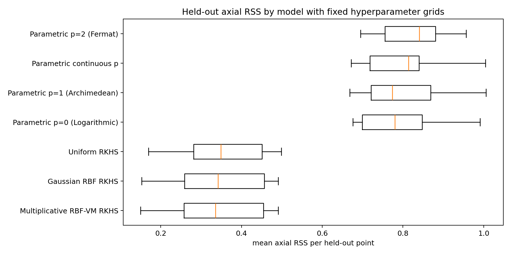

## Fitted Overlays

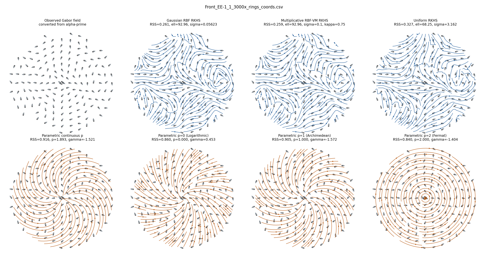
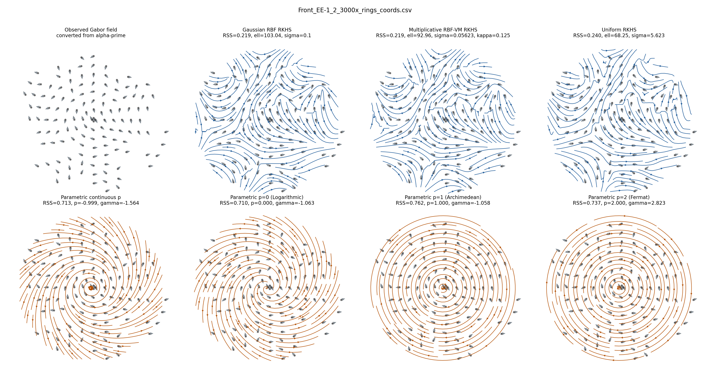

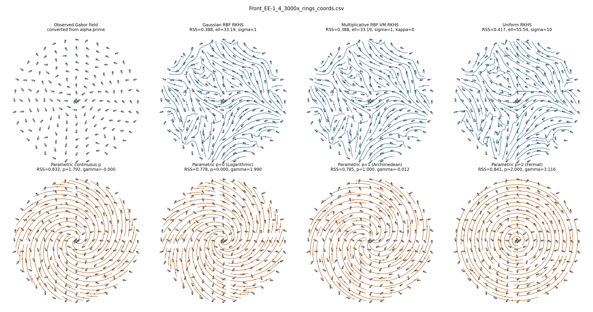
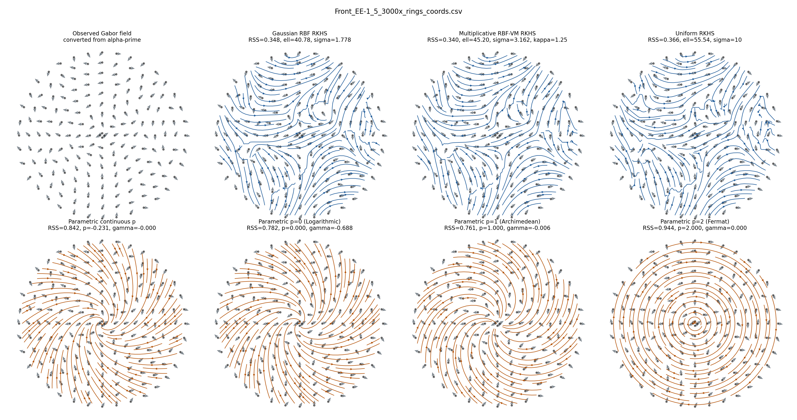
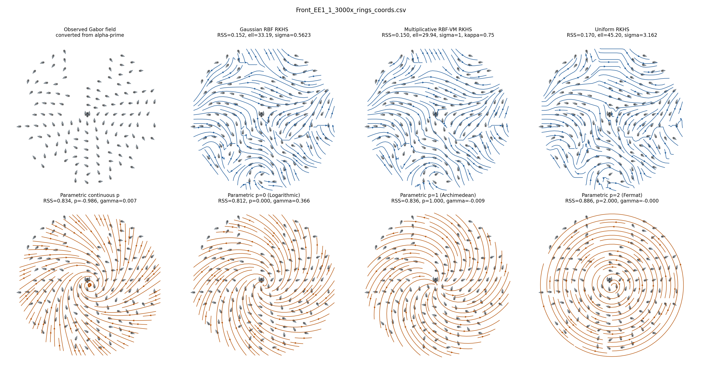
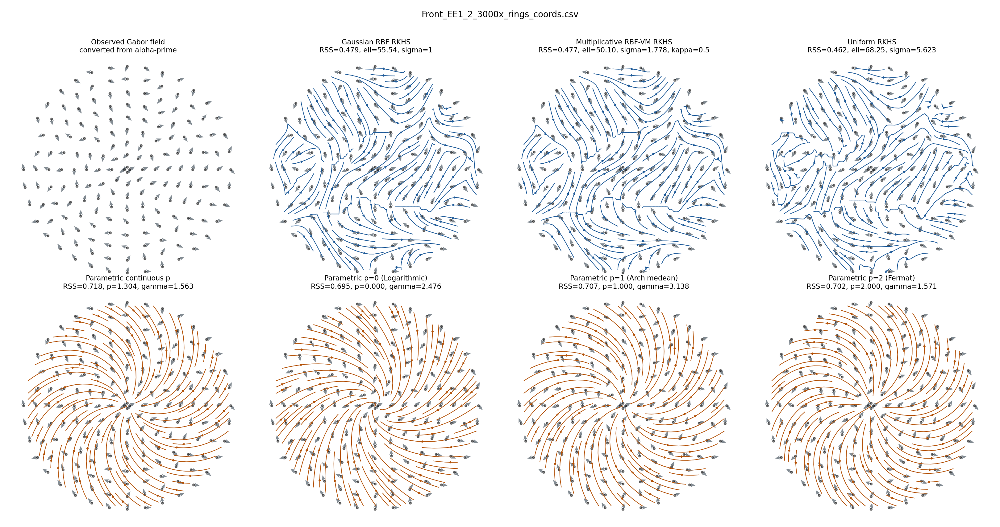
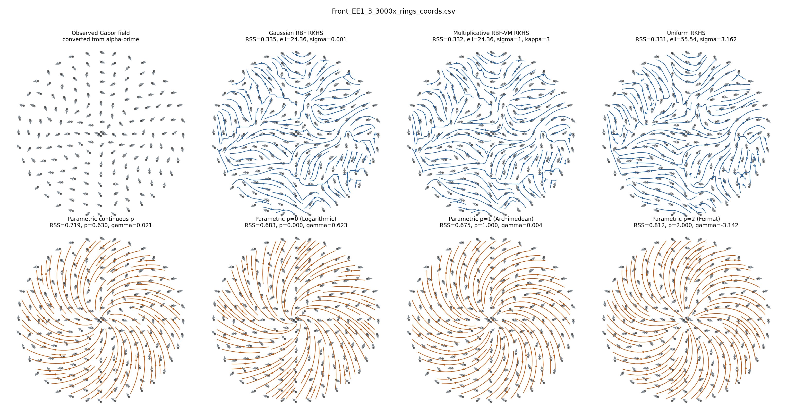
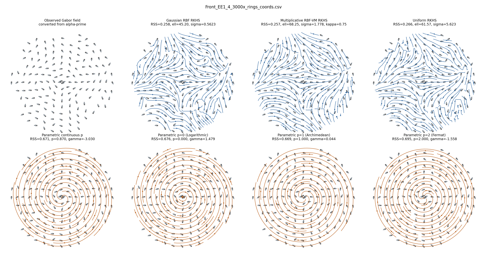
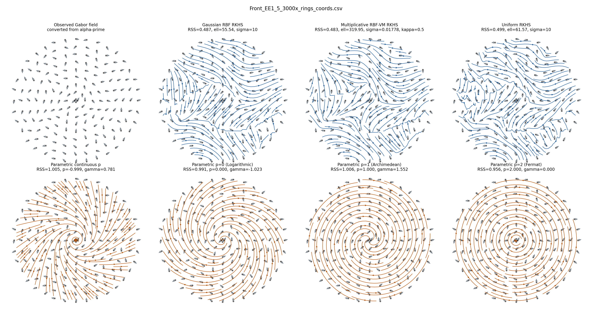