# vf_exports Kernel Smoother Comparison

This analysis treats the Gabor CSV files as line-field observations. Each row gives a coordinate and local pitch angle alpha-prime; the global direction is reconstructed as `phi = atan2(y, x) + alpha-prime`.

The non-parametric models are Nadaraya-Watson kernel smoothers on the doubled-angle embedding `(cos 2phi, sin 2phi)`. The two kernels are Gaussian RBF and multiplicative RBF-von-Mises. Bandwidth and kappa are selected by shuffled 10-fold held-out axial reconstruction RSS over fixed, non-data-adaptive grids.

## Mean held-out RSS

| model | mean_test_rss_mean | mean_test_rss_median | mean_test_mae_deg_mean | bandwidth_median | kappa_median |
| --- | --- | --- | --- | --- | --- |
| RBF-von-Mises kernel smoother | 0.3577 | 0.3496 | 25.5983 | 29.9372 | 0.75 |
| RBF kernel smoother | 0.3608 | 0.354 | 25.6744 | 29.9372 |  |

## Parametric comparison

| model | mean_test_rss_mean | mean_test_rss_median | mean_test_mae_deg_mean |
| --- | --- | --- | --- |
| RBF-von-Mises kernel smoother | 0.3577 | 0.3496 | 25.5983 |
| RBF kernel smoother | 0.3608 | 0.354 | 25.6744 |
| Parametric continuous p | 0.5588 | 0.5885 | 35.2181 |
| Parametric p=1 (Archimedean) | 0.5949 | 0.5892 | 36.668 |
| Parametric p=0 (Logarithmic) | 0.6362 | 0.6331 | 38.2387 |
| Parametric p=2 (Fermat) | 0.6567 | 0.6875 | 38.8822 |

## Plots

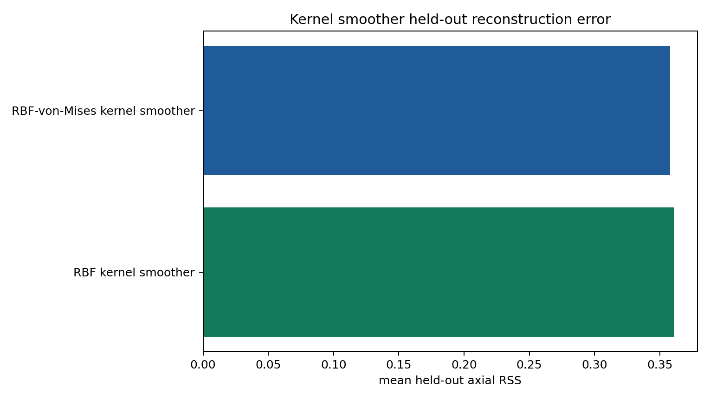

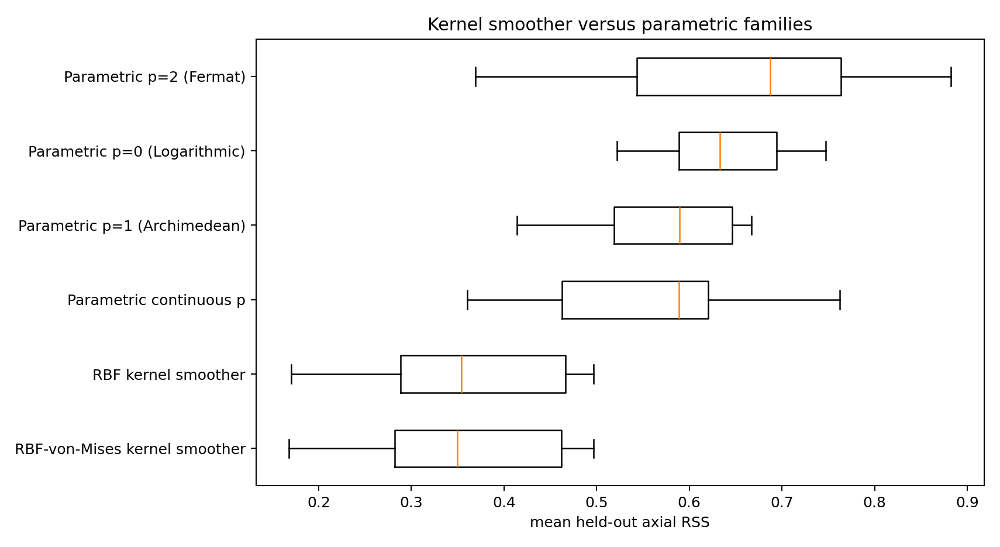

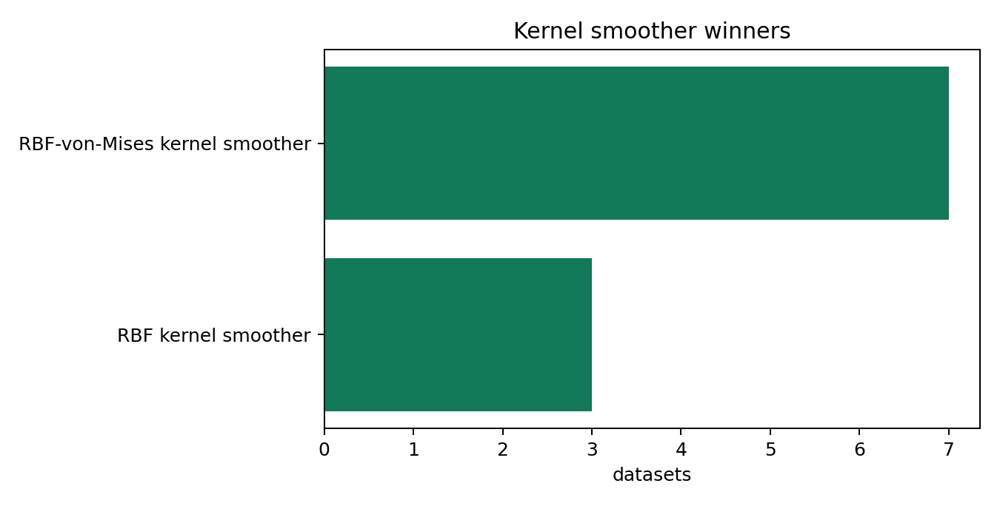

### Front_EE-1_1_3000x_rings_coords.csv

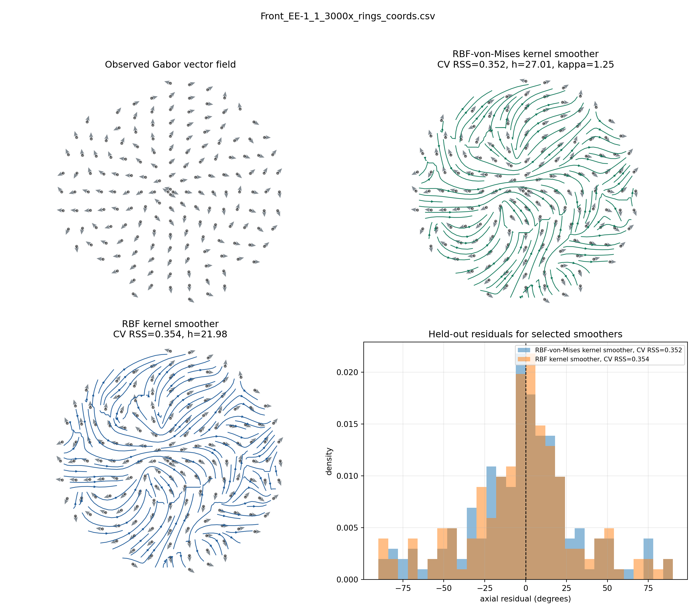

### Front_EE-1_2_3000x_rings_coords.csv

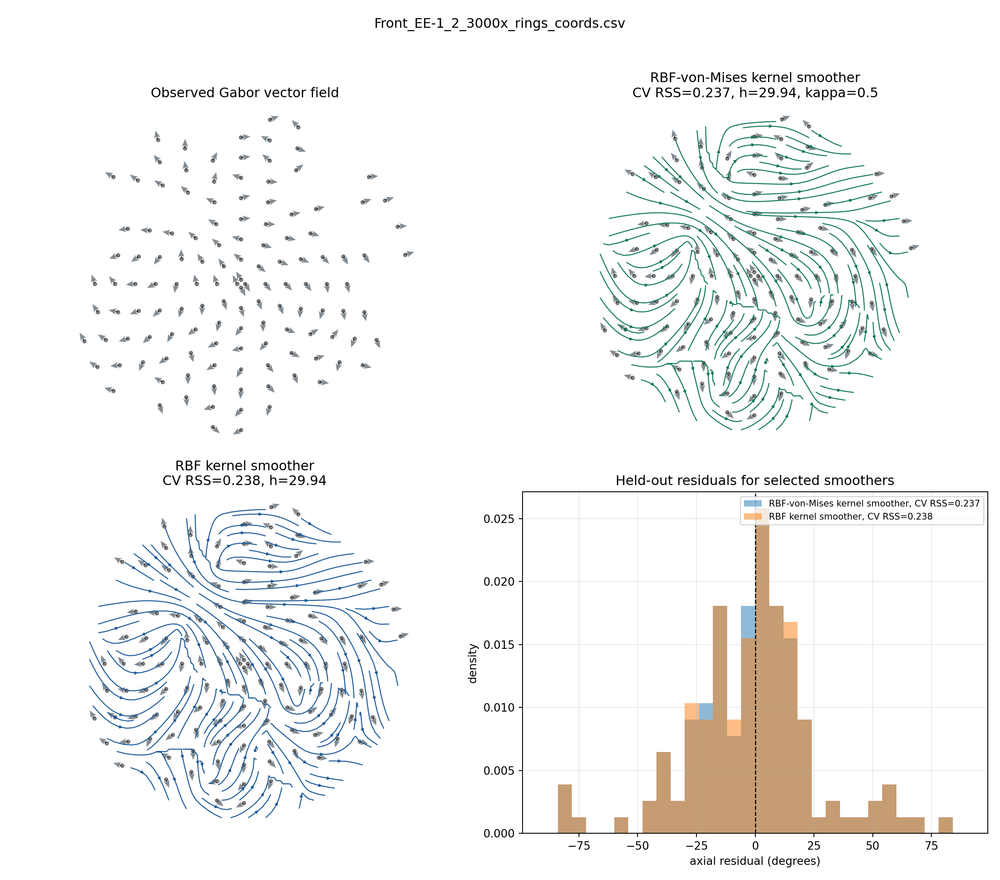

### Front_EE-1_3_3000x_rings_coords.csv

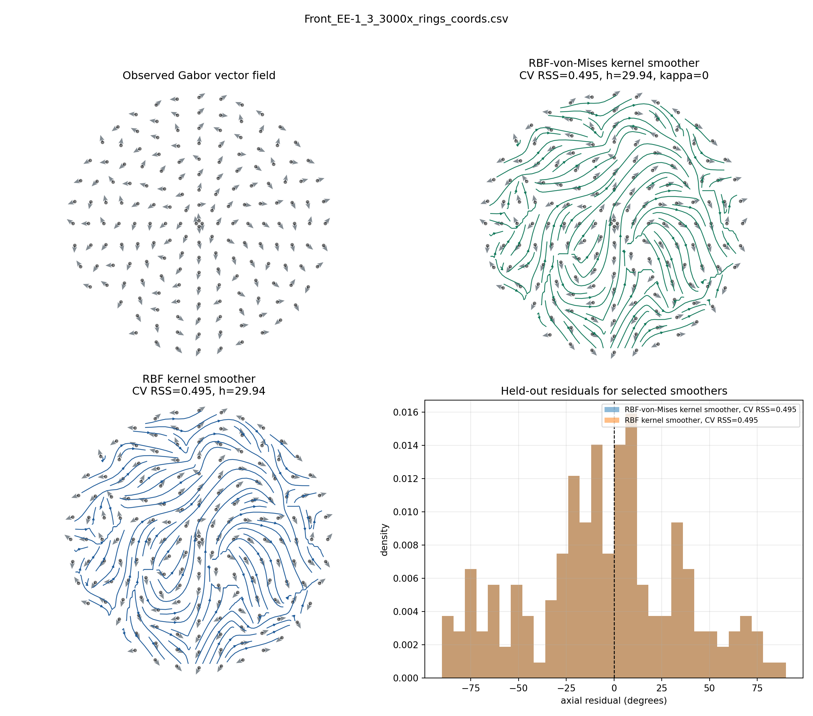

### Front_EE-1_4_3000x_rings_coords.csv

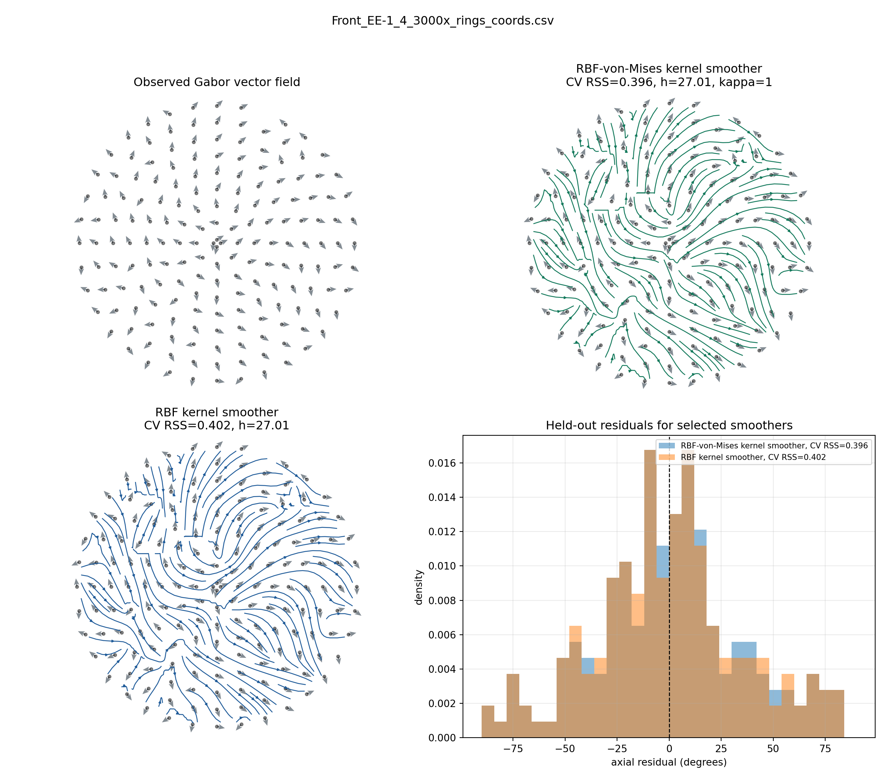

### Front_EE-1_5_3000x_rings_coords.csv

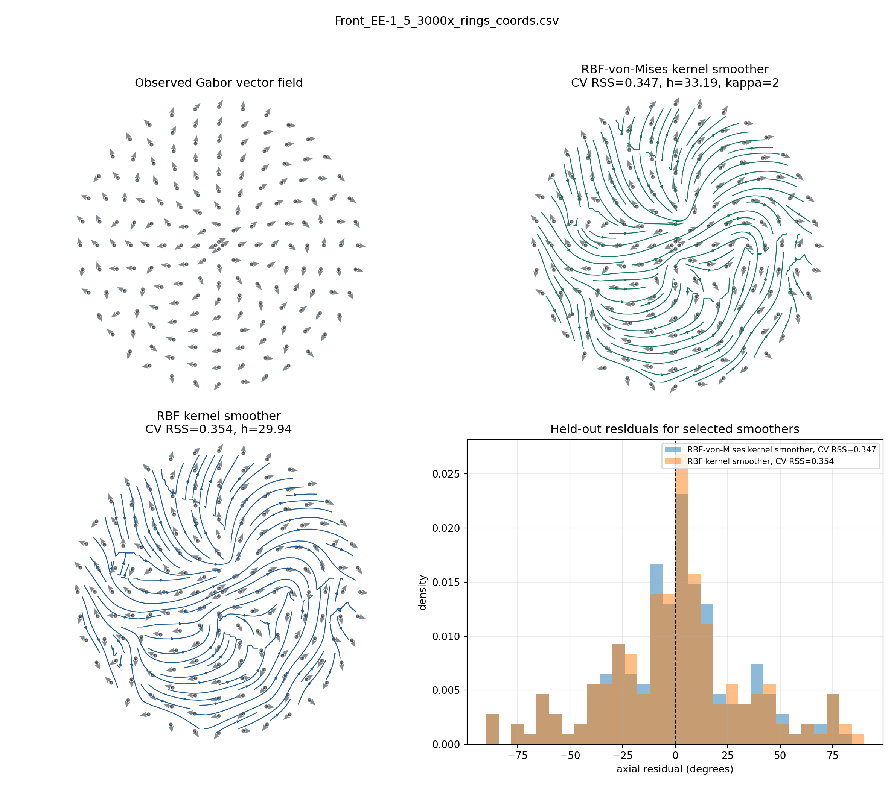

### Front_EE1_1_3000x_rings_coords.csv

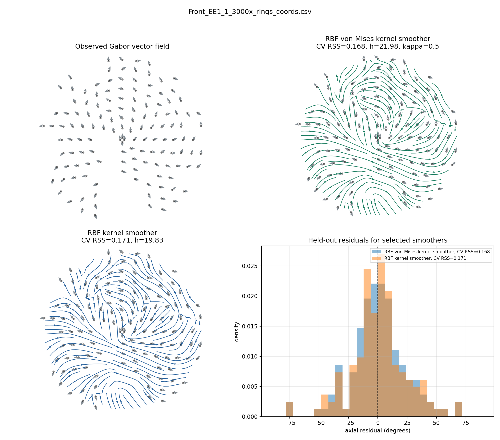

### Front_EE1_2_3000x_rings_coords.csv

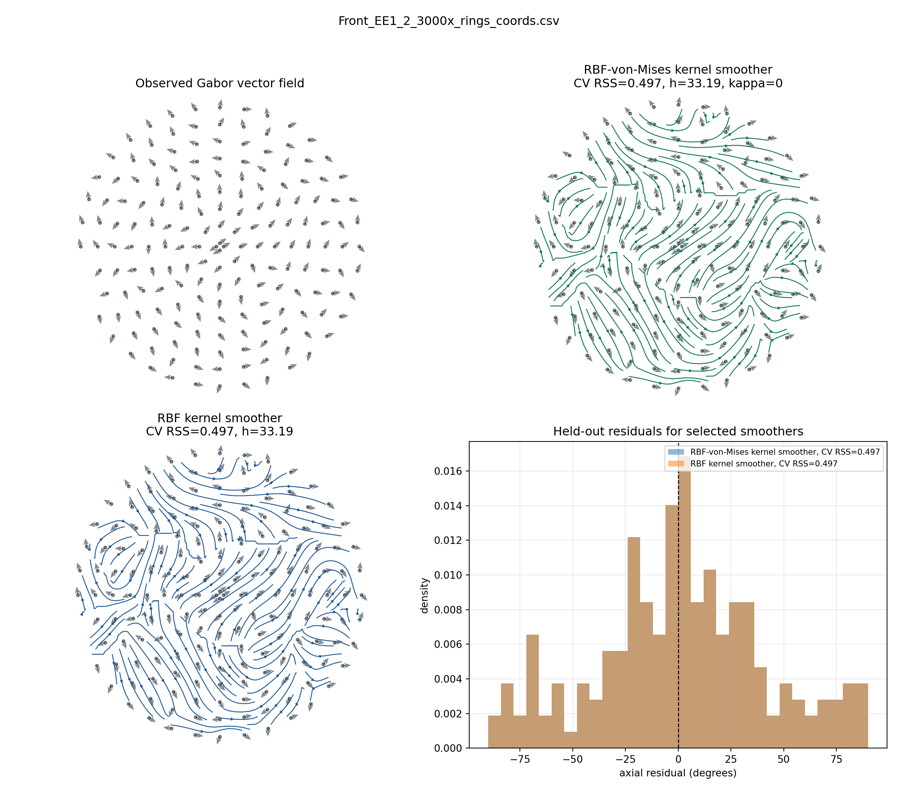

### Front_EE1_3_3000x_rings_coords.csv

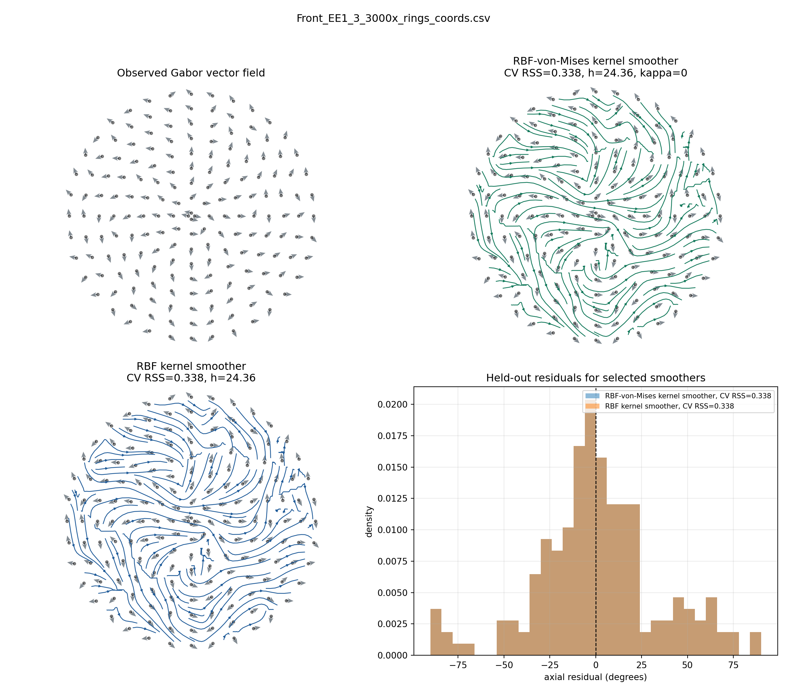

### Front_EE1_4_3000x_rings_coords.csv

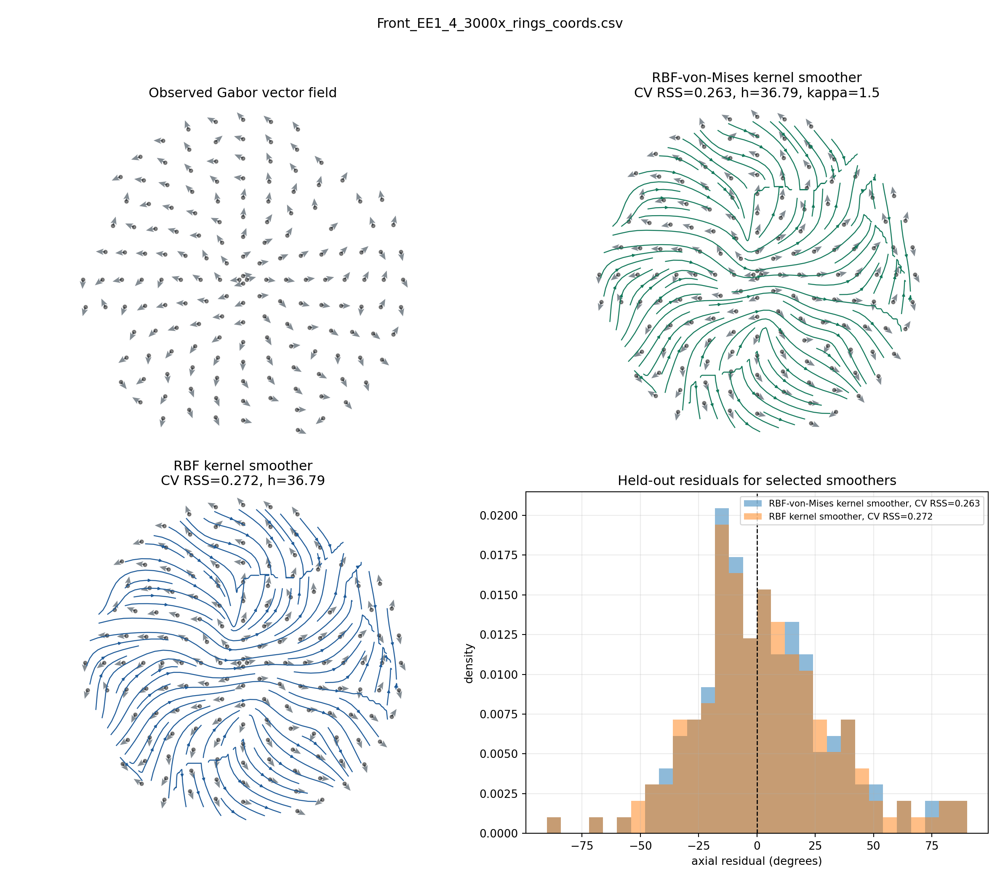

### Front_EE1_5_3000x_rings_coords.csv

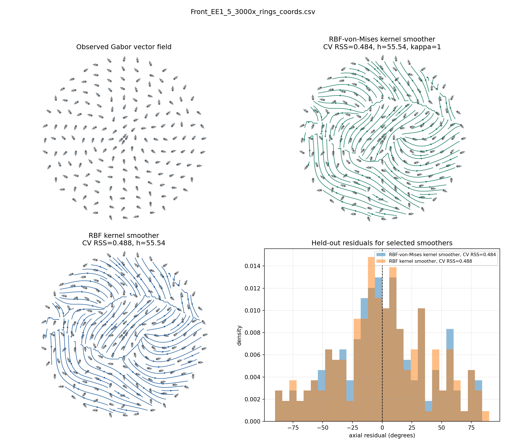
