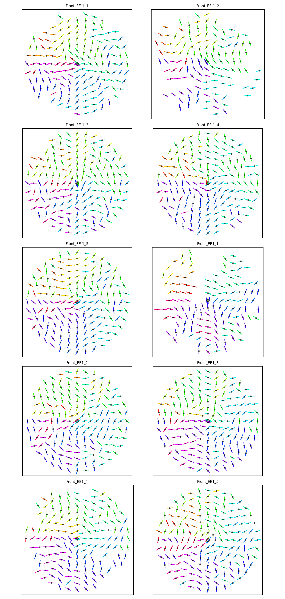
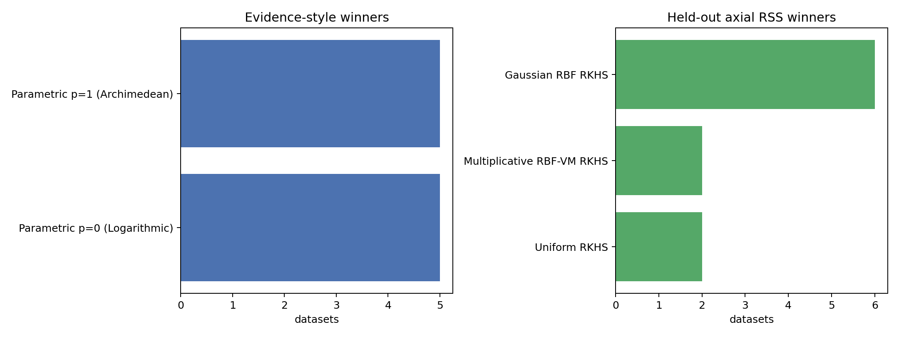
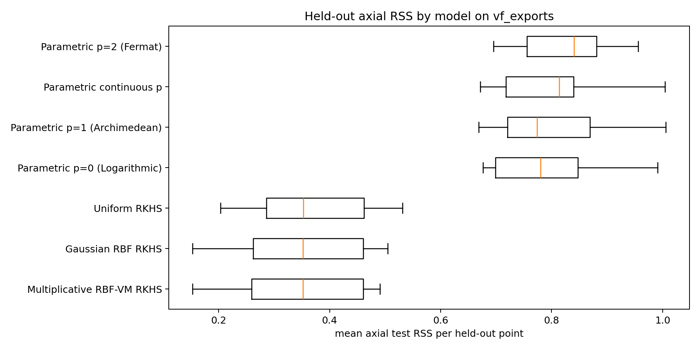
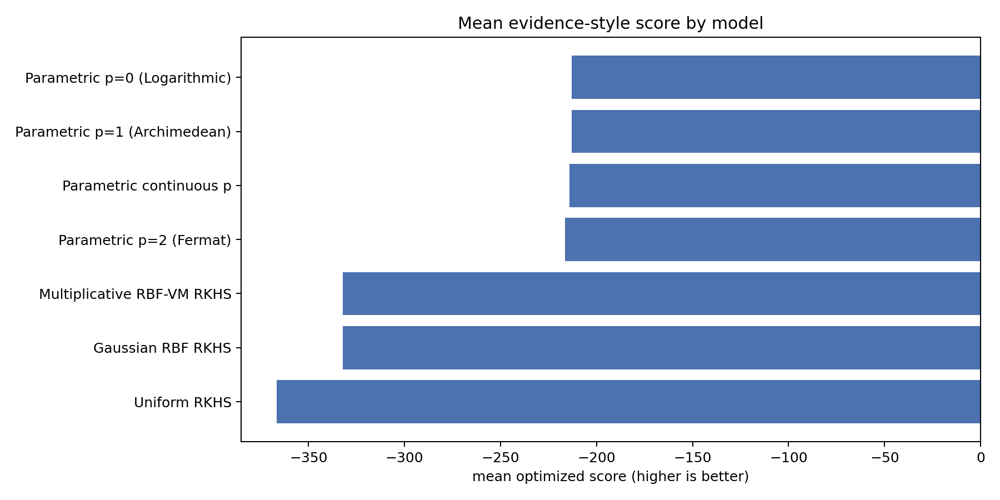

# vf_exports Axial Line-Field Comparison

CSV files found: **10**
Datasets processed: **10**
Datasets skipped: **0**

The `vf_exports/*.csv` files are treated as vector-field exports from the Gabor-filter workflow. Each row supplies `Coordinate` and local pitch angle `Angle (α′)`. The comparison converts these into global axial line-field observations by computing `phi = atan2(y, x) + alpha`, then fits the same kernel and non-kernel families used by `cleaned_linefield_comparison.py`.

## Evidence Identity Audit
The exact equality between Gaussian RBF and Multiplicative RBF-VM evidence is explained by the optimized multiplicative evidence choosing `kappa=0` on every dataset. With `kappa=0`, the von-Mises factor is `exp(0*cos(delta))=1`, so the multiplicative kernel is exactly the Gaussian RBF kernel at the same bandwidth. The audit CSV verifies that the selected Gram matrices have zero maximum absolute difference.
| dataset | multiplicative_kappa | same_hyperparameters | max_abs_gram_diff |
|---|---|---|---|
| Front_EE-1_1_3000x_rings_coords.csv | 0.0 | True | 0.0 |
| Front_EE-1_2_3000x_rings_coords.csv | 0.0 | True | 0.0 |
| Front_EE-1_3_3000x_rings_coords.csv | 0.0 | True | 0.0 |
| Front_EE-1_4_3000x_rings_coords.csv | 0.0 | True | 0.0 |
| Front_EE-1_5_3000x_rings_coords.csv | 0.0 | True | 0.0 |
| Front_EE1_1_3000x_rings_coords.csv | 0.0 | True | 0.0 |
| Front_EE1_2_3000x_rings_coords.csv | 0.0 | True | 0.0 |
| Front_EE1_3_3000x_rings_coords.csv | 0.0 | True | 0.0 |
| Front_EE1_4_3000x_rings_coords.csv | 0.0 | True | 0.0 |
| Front_EE1_5_3000x_rings_coords.csv | 0.0 | True | 0.0 |

## Evidence-Style Winner Counts
| model | wins |
|---|---|
| Parametric p=1 (Archimedean) | 5 |
| Parametric p=0 (Logarithmic) | 5 |

## Held-Out Axial RSS Winner Counts
| model | wins |
|---|---|
| Gaussian RBF RKHS | 6 |
| Multiplicative RBF-VM RKHS | 2 |
| Uniform RKHS | 2 |

## Held-Out Axial NLPD Winner Counts
| model | wins |
|---|---|
| Uniform RKHS | 9 |
| Multiplicative RBF-VM RKHS | 1 |

## Evidence Summary
| model | family | datasets | evidence_score_mean | evidence_score_median | p_median |
|---|---|---|---|---|---|
| Parametric p=0 (Logarithmic) | parametric_fixed_p | 10 | -212.9504 | -221.2425 | 0.0 |
| Parametric p=1 (Archimedean) | parametric_fixed_p | 10 | -213.0082 | -221.0379 | 1.0 |
| Parametric continuous p | parametric_continuous_p | 10 | -214.1571 | -223.4111 | 0.0901 |
| Parametric p=2 (Fermat) | parametric_fixed_p | 10 | -216.4229 | -224.1087 | 2.0 |
| Gaussian RBF RKHS | kernel_gp_line_embedding_lml | 10 | -332.1158 | -363.3648 |  |
| Multiplicative RBF-VM RKHS | kernel_gp_line_embedding_lml | 10 | -332.1158 | -363.3648 |  |
| Uniform RKHS | kernel_gp_line_embedding_lml | 10 | -366.6836 | -390.6431 |  |

## RSS Summary
| model | family | datasets | mean_test_rss_mean | mean_test_rss_median | mean_test_mae_deg_mean | p_median |
|---|---|---|---|---|---|---|
| Multiplicative RBF-VM RKHS | kernel_gp_line_embedding_cv | 10 | 0.3449 | 0.3515 | 24.8583 |  |
| Gaussian RBF RKHS | kernel_gp_line_embedding_cv | 10 | 0.3475 | 0.3515 | 24.9205 |  |
| Uniform RKHS | kernel_gp_line_embedding_cv | 10 | 0.3675 | 0.3524 | 26.1212 |  |
| Parametric p=0 (Logarithmic) | parametric_fixed_p | 10 | 0.7851 | 0.78 | 43.843 | 0.0 |
| Parametric p=1 (Archimedean) | parametric_fixed_p | 10 | 0.7986 | 0.7736 | 43.964 | 1.0 |
| Parametric continuous p | parametric_continuous_p | 10 | 0.8045 | 0.8138 | 44.3255 | 0.1993 |
| Parametric p=2 (Fermat) | parametric_fixed_p | 10 | 0.8278 | 0.8407 | 44.8518 | 2.0 |

## Axial NLPD Summary
This uses one common held-out likelihood for every model: a Gaussian density on the axial residual, with the residual scale estimated on the corresponding training fold. Lower is better.
| model | family | datasets | mean_test_nlpd_mean | mean_test_nlpd_median | mean_train_axial_sigma_mean | mean_test_mae_deg_mean | p_median |
|---|---|---|---|---|---|---|---|
| Uniform RKHS | kernel_gp_line_embedding_cv | 10 | 0.9525 | 0.9806 | 0.5541 | 26.675 |  |
| Multiplicative RBF-VM RKHS | kernel_gp_line_embedding_cv | 10 | 1.0175 | 1.0451 | 0.5453 | 29.2141 |  |
| Gaussian RBF RKHS | kernel_gp_line_embedding_cv | 10 | 1.0289 | 1.0722 | 0.561 | 29.7742 |  |
| Parametric p=0 (Logarithmic) | parametric_fixed_p | 10 | 1.3002 | 1.2975 | 0.8503 | 43.843 | 0.0 |
| Parametric p=1 (Archimedean) | parametric_fixed_p | 10 | 1.3096 | 1.2964 | 0.851 | 43.964 | 1.0 |
| Parametric continuous p | parametric_continuous_p | 10 | 1.315 | 1.321 | 0.8421 | 44.3255 | 0.1993 |
| Parametric p=2 (Fermat) | parametric_fixed_p | 10 | 1.3266 | 1.3375 | 0.8671 | 44.8518 | 2.0 |

## Input Line Fields

## Model Comparison Plots

