# vf_exports Pitch Kernel Smoother Comparison

This analysis follows `python_notebooks/streamlines.ipynb`: the model smooths local pitch angle `alpha-prime`, reconstructs `phi = atan2(y, x) + alpha-prime`, and renders streamlines by interpolating fitted sample vectors onto a dense grid with a director-field continuity correction.

Bandwidth and kappa are selected by shuffled 10-fold held-out axial reconstruction RSS over fixed, non-data-adaptive grids.

## Mean held-out RSS

| model | mean_test_rss_mean | mean_test_rss_median | mean_test_mae_deg_mean | bandwidth_median | kappa_median |
| --- | --- | --- | --- | --- | --- |
| RBF-von-Mises pitch kernel smoother | 0.3615 | 0.3483 | 26.2678 | 33.1853 | 28 |
| RBF pitch kernel smoother | 0.5526 | 0.5822 | 34.7341 | 47.6528 |  |

## Parametric comparison

| model | mean_test_rss_mean | mean_test_rss_median | mean_test_mae_deg_mean |
| --- | --- | --- | --- |
| RBF-von-Mises pitch kernel smoother | 0.3615 | 0.3483 | 26.2678 |
| RBF pitch kernel smoother | 0.5526 | 0.5822 | 34.7341 |
| Parametric continuous p | 0.5588 | 0.5885 | 35.2181 |
| Parametric p=1 (Archimedean) | 0.5949 | 0.5892 | 36.668 |
| Parametric p=0 (Logarithmic) | 0.6362 | 0.6331 | 38.2387 |
| Parametric p=2 (Fermat) | 0.6567 | 0.6875 | 38.8822 |

## Plots

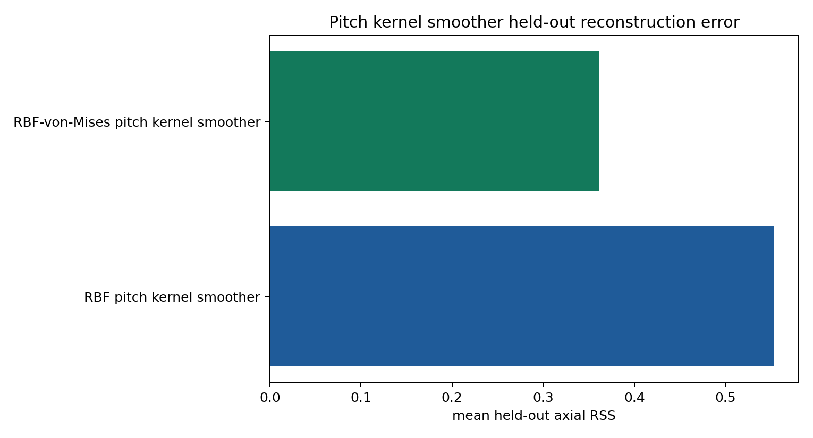

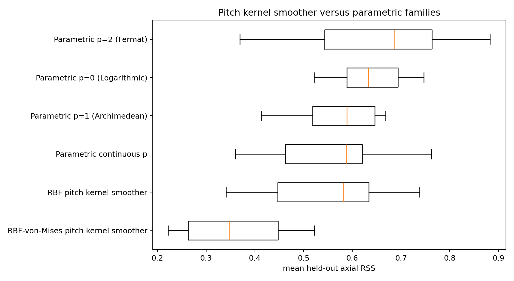

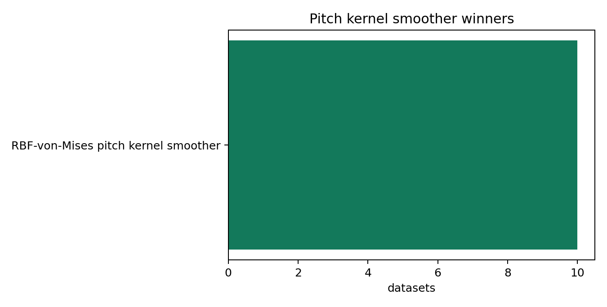

### Front_EE-1_1_3000x_rings_coords.csv

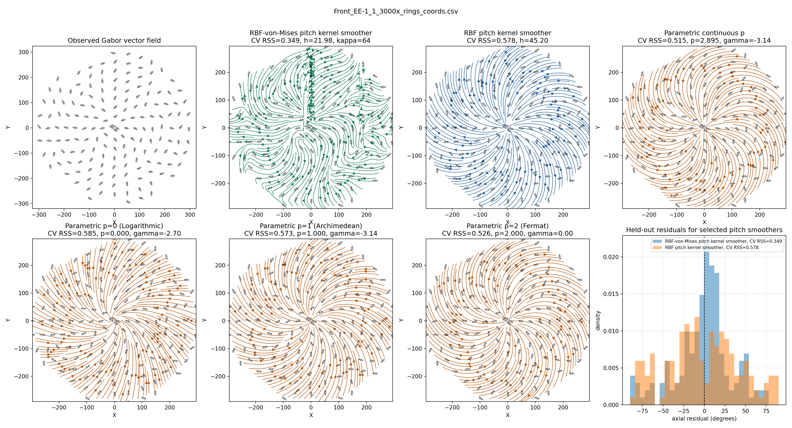

### Front_EE-1_2_3000x_rings_coords.csv

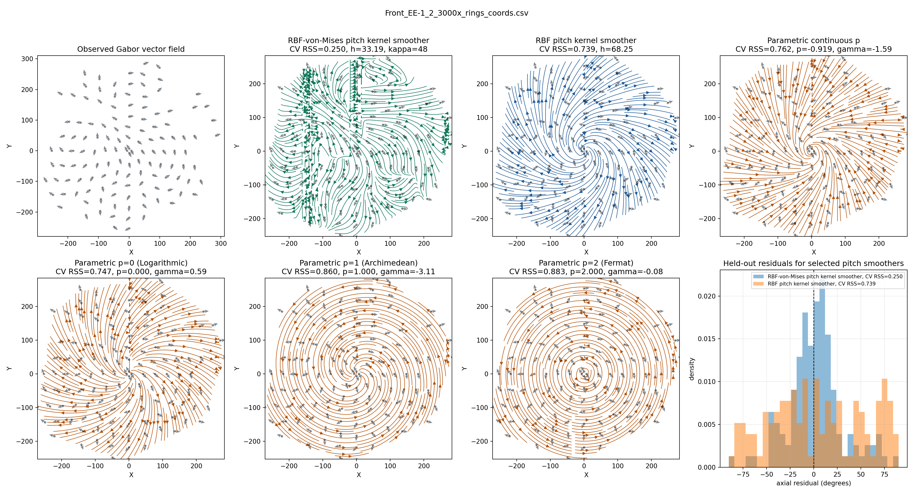

### Front_EE-1_3_3000x_rings_coords.csv

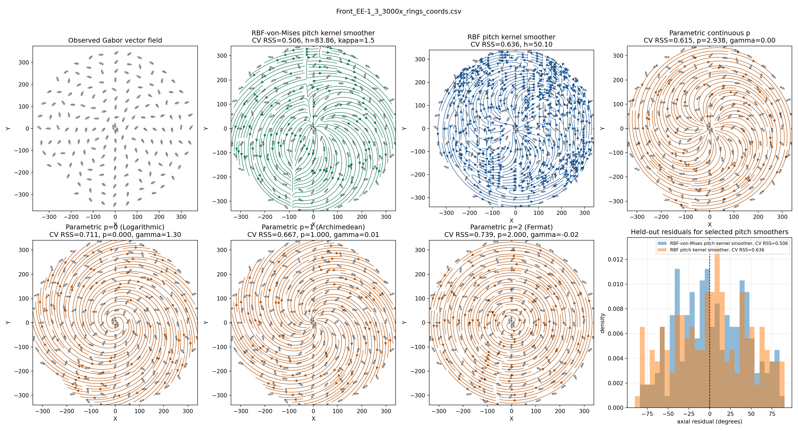

### Front_EE-1_4_3000x_rings_coords.csv

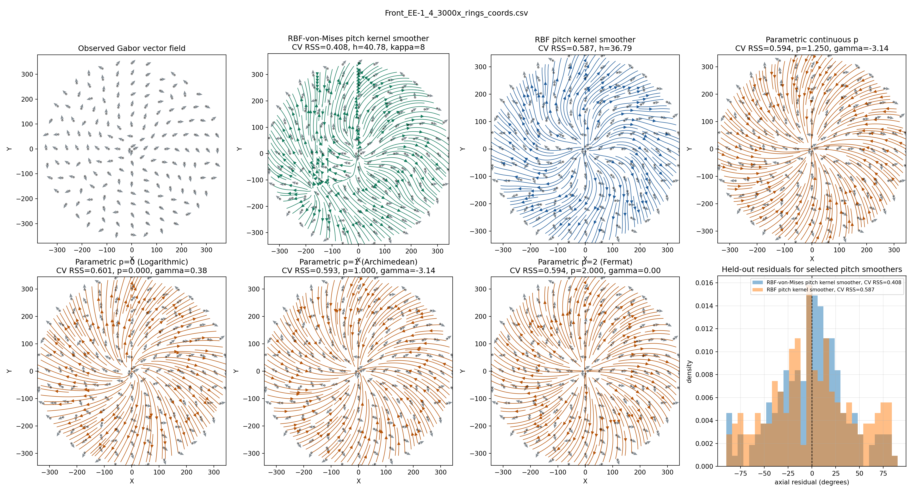

### Front_EE-1_5_3000x_rings_coords.csv

### Front_EE1_1_3000x_rings_coords.csv

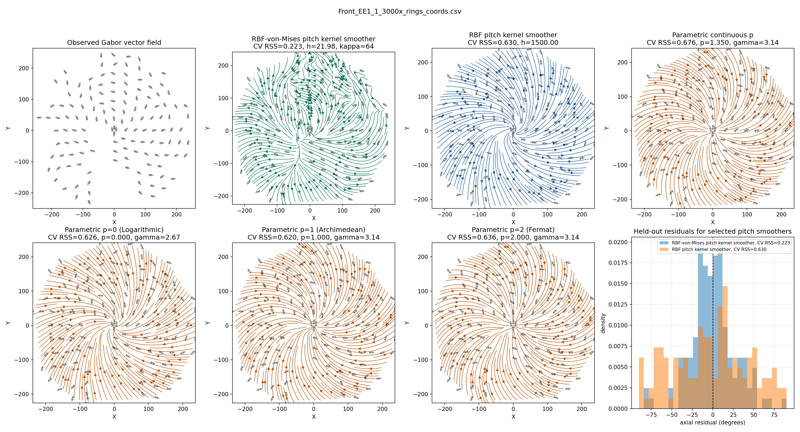

### Front_EE1_2_3000x_rings_coords.csv

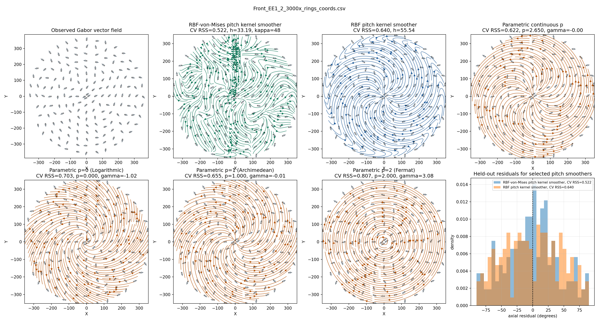

### Front_EE1_3_3000x_rings_coords.csv

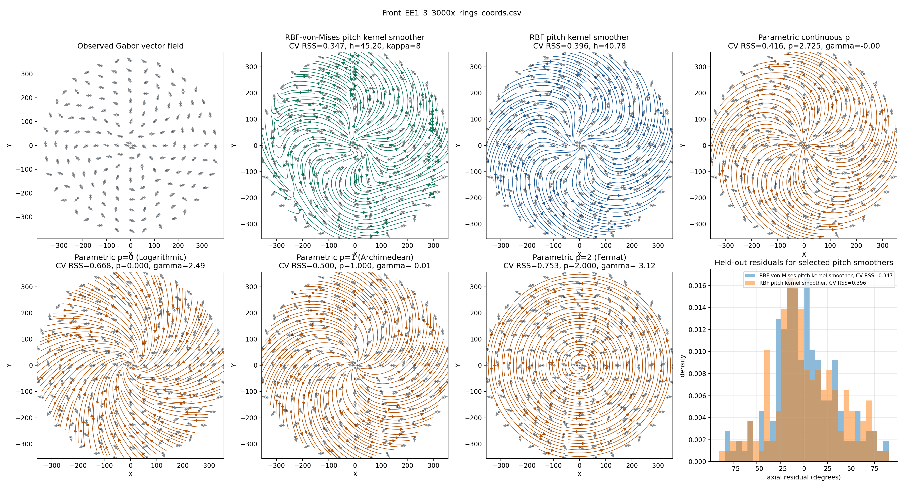

### Front_EE1_4_3000x_rings_coords.csv

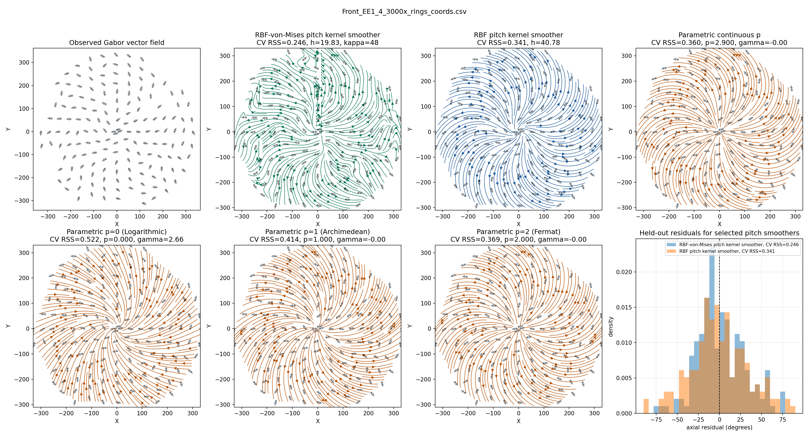

### Front_EE1_5_3000x_rings_coords.csv

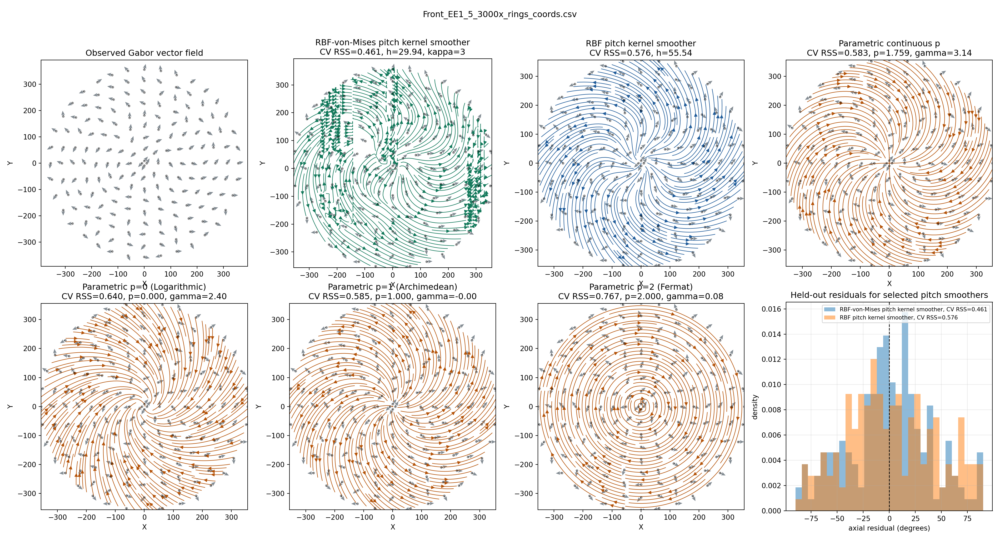
